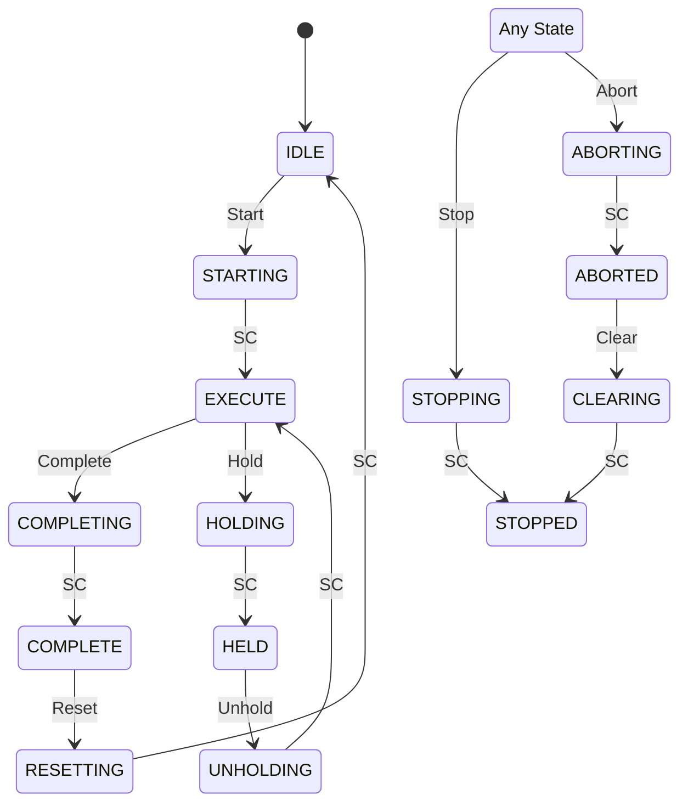

# Phase 2: Discuss + Plan Commands - Research

**Researched:** 2026-02-07
**Domain:** Claude Code slash commands for FDS documentation phase discussion and planning
**Confidence:** HIGH

## Summary

Phase 2 creates two slash commands (`/doc:discuss-phase N` and `/doc:plan-phase N`) plus three FDS section templates (equipment module, state machine, interface). These commands adapt the GSD reference implementation patterns to the industrial documentation domain, where the key difference is that plans produce documentation writing instructions rather than code execution instructions.

The research examined: (1) the GSD reference implementations of discuss-phase and plan-phase, (2) the Phase 1 established patterns (lean command + detailed workflow separation, @-reference context injection, DOC > UI brand), (3) the SPECIFICATION.md FDS template definitions, and (4) the CONTEXT.md decisions about gray area identification, plan structure, and template configurability.

**Primary recommendation:** Follow the Phase 1 pattern exactly -- lean command files (~60-80 lines) delegating to detailed workflow files (~400-600 lines each), with FDS section templates as standalone structural files in `gsd-docs-industrial/templates/fds/`. The plan-phase command does NOT need subagent orchestration for this plugin build; it runs as a single command that reads CONTEXT.md and generates NN-MM-PLAN.md files directly. Subagent orchestration is for when the command is used in FDS projects (spawning writers), not for building the command itself.

## Standard Stack

This phase creates markdown command files and workflow instructions -- no external libraries. The "stack" is the established patterns from Phase 1.

### Core

| Component | Location | Purpose | Why Standard |
|-----------|----------|---------|--------------|
| Command file | `commands/doc/{command}.md` | Slash command entry point | Phase 1 pattern: frontmatter + @-references + success criteria |
| Workflow file | `gsd-docs-industrial/workflows/{command}.md` | Full execution logic | Phase 1 pattern: `<workflow>` wrapped, numbered steps |
| FDS templates | `gsd-docs-industrial/templates/fds/*.md` | Section structure templates | SPECIFICATION.md section 5.1.1 defines exact format |
| CONTEXT.md template | `gsd-docs-industrial/templates/context.md` | Phase context capture template | GSD reference uses this; adapted for FDS domain |
| PLAN.md format | (inline in workflow) | Section plan format | Adapted from GSD PLAN.md with doc-specific fields |

### Supporting

| Component | Location | Purpose | When Used |
|-----------|----------|---------|-----------|
| ui-brand.md | `gsd-docs-industrial/references/ui-brand.md` | Stage banners, checkpoints | @-referenced by both commands |
| CLAUDE-CONTEXT.md | `gsd-docs-industrial/CLAUDE-CONTEXT.md` | Project type context | @-referenced by both commands |
| writing-guidelines.md | `gsd-docs-industrial/references/writing-guidelines.md` | Writing rules for plan verification | Referenced in PLAN.md verification checklists |

### File Locations (Two Copies)

Following the Phase 1 decision: command files exist both in the project repo (`commands/doc/`) for version control AND are junction-linked to `~/.claude/commands/doc/` for Claude Code registration. Similarly, plugin files live in `gsd-docs-industrial/` in the project repo and junction-link to `~/.claude/gsd-docs-industrial/`.

## Architecture Patterns

### Deliverables Map

```
Phase 2 creates:
commands/doc/
  discuss-phase.md            # Command file (~60-80 lines)
  plan-phase.md               # Command file (~60-80 lines)

gsd-docs-industrial/
  workflows/
    discuss-phase.md          # Workflow file (~400-500 lines)
    plan-phase.md             # Workflow file (~400-600 lines)
  templates/
    fds/
      section-equipment-module.md   # EM template (~80-120 lines)
      section-state-machine.md      # State machine template (~50-70 lines)
      section-interface.md          # Interface template (~50-70 lines)
    context.md                # CONTEXT.md template (~60-80 lines)
  commands/
    discuss-phase.md          # Version-tracked copy of command
    plan-phase.md             # Version-tracked copy of command
```

### Pattern 1: Lean Command + Detailed Workflow (Established in Phase 1)

**What:** Command files have frontmatter, @-references, objective, and success criteria. All execution logic lives in the workflow file.
**When to use:** Every command follows this pattern.
**Source:** Phase 1 established this with new-fds.md (62 lines) + workflows/new-fds.md (544 lines).

```markdown
# Command file structure (lean, ~60-80 lines):
---
name: doc:discuss-phase
description: ...
argument-hint: "<phase>"
allowed-tools: [Read, Write, Bash, Glob, Grep, AskUserQuestion]
---

<objective>...</objective>

<execution_context>
@~/.claude/gsd-docs-industrial/workflows/discuss-phase.md
@~/.claude/gsd-docs-industrial/references/ui-brand.md
@~/.claude/gsd-docs-industrial/CLAUDE-CONTEXT.md
</execution_context>

<context>
Phase number: $ARGUMENTS
@.planning/STATE.md
@.planning/ROADMAP.md
@.planning/PROJECT.md
</context>

<process>
Follow the workflow in discuss-phase.md exactly.
</process>

<success_criteria>...</success_criteria>
```

### Pattern 2: FDS-Domain Gray Area Identification (NEW for Phase 2)

**What:** Unlike GSD which analyzes software domains (visual, CLI, API), the discuss command analyzes FDS documentation domains (equipment modules, interfaces, HMI, safety). Gray areas are dynamically generated from the phase goal and content type.
**When to use:** Every `/doc:discuss-phase N` execution.

The GSD discuss-phase identifies gray areas by asking "What kind of thing is being built?" (something users SEE, CALL, RUN, READ). The doc adaptation asks "What kind of FDS content is being written?" and probes at full functional spec depth:

| Phase Content Type | Gray Area Categories | Probe Depth |
|-------------------|---------------------|-------------|
| Equipment Modules | Capacities, tolerances, failure modes, timing, operating sequences | Operational parameters AND interlocks, manual overrides, startup/shutdown |
| System Architecture | Hierarchy depth, mode transitions, shared resources | Equipment grouping, operating mode definitions |
| Interfaces | Protocols, polling rates, error handling, signal formats | Handshake behavior, timeout recovery, data validation |
| HMI | Layout, navigation, user flows, alarm presentation | Screen hierarchy, access control, trend displays |
| Safety | Risk categories, interlock priorities, E-stop behavior | Safety functions, SIL levels, fail-safe states |
| Foundation | Scope boundaries, terminology, standards selection | What's in vs out, reference documents |
| Appendices | Cross-references, compilation rules | Signal list format, parameter list completeness |

**Critical adaptation from CONTEXT.md decisions:**
- For Type C/D projects: always reference BASELINE.md to focus discussion on deltas
- Cross-references to not-yet-documented equipment: capture decision, flag for review
- Probe at FULL functional spec depth (not just surface questions)

### Pattern 3: Doc-Domain PLAN.md Format (NEW for Phase 2)

**What:** Plans for documentation sections have a different shape than code execution plans. The plan tells a writer subagent what documentation to produce, what context to load, and what verification to check.
**When to use:** Every NN-MM-PLAN.md generated by `/doc:plan-phase N`.

The SPECIFICATION.md (section 4.3) defines the doc PLAN format:

```markdown
---
phase: 3
plan: 02
name: EM-200 Bovenloopkraan
wave: 1
depends_on: []
autonomous: true
---

# EM-200 Bovenloopkraan

## Goal
Volledige beschrijving van de bovenloopkraan inclusief states,
parameters, en interlocks.

## Sections
1. Beschrijving en functie
2. Operating states (PackML)
3. Parameters
4. Interlocks
5. Interfaces (I/O)

## Context
- Max last: 500 kg (uit CONTEXT.md)
- Collision detection: niet vereist
- E-stop gedrag: controlled stop, positie behouden

## Template
@~/.claude/gsd-docs-industrial/templates/fds/section-equipment-module.md

## Standards
- PackML states verplicht
- ISA-88 terminologie

## Verification
- [ ] Alle states beschreven met entry/exit conditions
- [ ] Alle parameters hebben bereik en eenheid
- [ ] Alle interlocks hebben conditie en actie
- [ ] I/O lijst compleet
```

**Key differences from GSD PLAN.md:**
1. `## Sections` lists documentation sections, not code tasks
2. `## Context` extracts relevant decisions from CONTEXT.md for this specific section
3. `## Template` references which FDS section template to use
4. `## Standards` lists which standards apply (if enabled) -- by name, not inline
5. `## Verification` has documentation-quality checks, not code functionality checks
6. No `<task type="auto">` elements -- writer subagent uses the plan holistically
7. `## Goal` is a documentation goal, not a code implementation goal

### Pattern 4: Wave Assignment for Documentation (NEW for Phase 2)

**What:** Wave assignment groups documentation sections for parallel writing. Unlike code where dependencies are imports/APIs, documentation dependencies are content cross-references.
**When to use:** Every `/doc:plan-phase N` execution.

**Wave assignment strategy (from CONTEXT.md: Claude's discretion):**

For Equipment Module phases (most common, largest):
- Wave 1: Independent EMs with no cross-EM interlocks
- Wave 2: EMs that reference Wave 1 EMs (e.g., via interlocks)
- Wave 3: Overview/summary sections that reference multiple EMs (e.g., Algemene Interlocks)

For other phase types:
- Foundation/scope: typically 1-2 waves (most sections are independent)
- System Architecture: 1-2 waves (overview first, details parallel)
- HMI/Interfaces: 2-3 waves (independent interfaces parallel, summary last)
- Appendices: 1-2 waves (signal list and parameter list can be parallel, but depend on all prior content)

**Dependency rules:**
- A section that cross-references another section's content should be in a later wave
- Sections within the same EM are always in the same plan (not split across plans)
- Overview/summary sections go in the last wave
- If no dependencies exist between sections, put them all in wave 1

### Pattern 5: Template Subsection Selection (NEW for Phase 2)

**What:** Equipment module templates have configurable subsections. The plan command selects which subsections apply based on equipment type.
**When to use:** When generating plans for equipment module phases.

From CONTEXT.md decisions:
```
Full subsection catalog:
1. Description                    -- always included
2. Operating States               -- always included
3. Parameters/Setpoints           -- always included
4. Interlocks                     -- always included
5. I/O Table                      -- always included
6. Manual Controls                -- if equipment has manual operation
7. Alarm List                     -- if equipment has alarms
8. Maintenance Mode               -- if equipment has maintenance procedures
9. Startup/Shutdown Sequence      -- if equipment has complex startup/shutdown
```

The plan command determines which subsections apply based on:
- Equipment type (valve = simple subset, conveyor = full set)
- Engineer decisions from CONTEXT.md
- Presence of standards (PackML adds state machine subsections)

### Anti-Patterns to Avoid

- **Copying GSD patterns verbatim without domain adaptation:** The discuss command must probe FDS-specific gray areas (capacities, tolerances, failure modes), not software gray areas (UI layout, API design).
- **Generating code-style plans:** Plans should describe documentation to write, not code to implement. No `<task type="auto">` XML, no `files_modified` paths.
- **Research subagent for doc planning:** The plan-phase command for an FDS project does NOT need web research or Context7 queries. The "research" is reading CONTEXT.md, ROADMAP.md, and PROJECT.md. Skip the research spawning pattern.
- **Over-specifying wave assignments:** Let the plan-phase workflow determine waves dynamically based on phase content, not hardcoded rules.
- **Inline standards content:** Plans reference standards modules by name. Writer loads them. Never embed PackML state lists in plans.

## Don't Hand-Roll

Problems that look simple but have existing solutions:

| Problem | Don't Build | Use Instead | Why |
|---------|-------------|-------------|-----|
| Context template format | Custom CONTEXT.md format | GSD context.md template adapted for FDS | GSD template has proven structure (domain, decisions, specifics, deferred) with XML section tags |
| FDS section templates | Design from scratch | SPECIFICATION.md section 5.1.1 templates | Exact table structures are defined in the spec -- follow them |
| Gray area identification logic | Custom categorization | Adapt GSD's domain analysis pattern | GSD pattern (analyze what kind of thing, generate specific areas) works -- just swap software domains for FDS domains |
| UI patterns (banners, checkpoints) | New visual patterns | @-reference existing ui-brand.md | All visual patterns already exist from Phase 1 |
| PLAN.md frontmatter format | New format | Adapt SPECIFICATION.md section 4.3 format | Spec defines phase, plan, name, wave, autonomous fields |

**Key insight:** Phase 2 is about creating COMMANDS that generate PLANS and CONTEXT -- it is NOT about writing FDS content itself. The commands are templates for Claude's behavior. Keep the focus on workflow instructions, not content generation.

## Common Pitfalls

### Pitfall 1: Confusing Plugin Build Plans vs. FDS Project Plans

**What goes wrong:** The plans generated by the planner for building Phase 2 (the PLAN.md files in `.planning/phases/02-discuss-plan-commands/`) are different from the PLAN.md files that `/doc:plan-phase` will generate for FDS projects. These must not be confused.
**Why it happens:** Same PLAN.md filename convention used at two levels.
**How to avoid:** Plans for building Phase 2 use the GSD format (with `<task type="auto">` elements). Plans generated BY the plan-phase command for FDS projects use the doc format (with `## Goal`, `## Sections`, `## Context`, `## Verification`).
**Warning signs:** If a Phase 2 build plan references FDS templates or wave assignments for documentation sections.

### Pitfall 2: Gray Area Questions Too Generic

**What goes wrong:** Discuss-phase asks generic questions like "What parameters does this equipment have?" instead of probing at functional spec depth.
**Why it happens:** Treating FDS discussion like a requirements-gathering interview rather than a technical specification deep-dive.
**How to avoid:** The workflow must instruct Claude to probe at FULL functional spec depth: not just "what are the parameters?" but "what is the temperature range, what happens on sensor failure, is there automatic recovery or manual intervention?"
**Warning signs:** Gray area questions that could apply to any equipment module without modification.

### Pitfall 3: Plan-Phase Generates Plans for Wrong Granularity

**What goes wrong:** Plans are either too coarse (one plan per entire phase) or too fine (one plan per subsection of one EM).
**Why it happens:** Not adapting granularity to the phase content type.
**How to avoid:** From CONTEXT.md decisions: granularity is Claude's discretion based on phase complexity. But the general pattern is:
- Equipment Module phases: one plan per EM (or per small group of related EMs)
- Foundation/Scope phases: one plan per logical section group
- Interface phases: one plan per interface (or per interface group)
- Appendix phases: one plan per appendix type
**Warning signs:** A single plan trying to cover 10 equipment modules, or 30 plans for a 3-section phase.

### Pitfall 4: CONTEXT.md Overload (ROADMAP Warning)

**What goes wrong:** CONTEXT.md captures too many decisions, overwhelming the writer subagent's context window.
**Why it happens:** Discussing too many areas at full depth without prioritization.
**How to avoid:** The discuss-phase workflow should:
1. Present 3-4 gray areas (not 8-10)
2. Use the GSD "4 questions per area, then check" pattern
3. Keep CONTEXT.md focused on decisions that change implementation
4. Use "Claude's Discretion" for areas that don't need engineer input
**Warning signs:** CONTEXT.md exceeding 100 lines, or containing implementation details rather than decisions.

### Pitfall 5: Templates That Are Too Prescriptive or Too Open

**What goes wrong:** Equipment module templates either force a rigid structure that doesn't fit all equipment types, or are so open that writers produce inconsistent output.
**Why it happens:** Not implementing the configurable subsection pattern from CONTEXT.md.
**How to avoid:** Templates define ALL possible subsections (the superset). The plan command selects which subsections apply. The template itself has comments/markers indicating which parts are conditional.
**Warning signs:** All equipment modules getting identical subsection lists regardless of type, or templates with no structure at all.

### Pitfall 6: Missing BASELINE.md Integration for Type C/D

**What goes wrong:** Discuss-phase for a Type C/D project asks about the full system instead of focusing on the delta.
**Why it happens:** Not reading BASELINE.md during gray area identification.
**How to avoid:** The discuss-phase workflow must check PROJECT.md for `is_modification: true`. If true, load BASELINE.md and frame questions as "The existing system does X -- are you changing this? How?"
**Warning signs:** CONTEXT.md for a Type C project that describes the full system instead of just the changes.

## Code Examples

### Example 1: discuss-phase Command File Structure

Source: Adapted from GSD discuss-phase.md (C:/Users/Aotte/.claude/commands/gsd/discuss-phase.md)

```markdown
---
name: doc:discuss-phase
description: Identify gray areas and capture implementation decisions for an FDS phase
argument-hint: "<phase>"
allowed-tools: [Read, Write, Bash, Glob, Grep, AskUserQuestion]
---

<objective>
Extract implementation decisions that downstream plan and write commands need.

1. Read ROADMAP.md to identify phase goals and content type
2. Identify gray areas specific to the FDS domain (equipment, interfaces, HMI, safety)
3. Present gray areas grouped by topic, let engineer select
4. Deep-dive each selected area at functional spec depth
5. Capture decisions in phase-N/CONTEXT.md

**Output:** `{phase}-CONTEXT.md` -- decisions clear enough that plan and write
commands can act without re-asking the engineer
</objective>

<execution_context>
@~/.claude/gsd-docs-industrial/workflows/discuss-phase.md
@~/.claude/gsd-docs-industrial/references/ui-brand.md
@~/.claude/gsd-docs-industrial/CLAUDE-CONTEXT.md
</execution_context>

<context>
Phase number: $ARGUMENTS (required)
@.planning/STATE.md
@.planning/ROADMAP.md
@.planning/PROJECT.md
</context>

<process>
Follow the workflow in discuss-phase.md exactly.
</process>

<success_criteria>
- [ ] Phase validated against ROADMAP.md
- [ ] Gray areas identified specific to phase content type
- [ ] Engineer selected which areas to discuss
- [ ] Each area explored at functional spec depth
- [ ] Scope creep redirected to deferred ideas
- [ ] CONTEXT.md captures decisions, not vague requirements
- [ ] Items marked Claude's Discretion documented but not asked
- [ ] For Type C/D: delta focus maintained via BASELINE.md reference
- [ ] Engineer knows next step is /doc:plan-phase N
</success_criteria>
```

### Example 2: plan-phase Command File Structure

Source: Adapted from GSD plan-phase.md (C:/Users/Aotte/.claude/commands/gsd/plan-phase.md)

```markdown
---
name: doc:plan-phase
description: Generate section plans with wave assignments for parallel FDS writing
argument-hint: "<phase> [--gaps]"
allowed-tools: [Read, Write, Bash, Glob, Grep]
---

<objective>
Create one PLAN.md per section for FDS phase N with wave assignments.

**Default flow:** Read context --> Generate plans --> Self-verify --> Done
**Gap closure:** Read VERIFICATION.md --> Generate fix plans --> Done

Each plan tells a writer subagent: what to write, what context to load,
which template to use, which standards apply, and how to verify.
</objective>

<execution_context>
@~/.claude/gsd-docs-industrial/workflows/plan-phase.md
@~/.claude/gsd-docs-industrial/references/ui-brand.md
@~/.claude/gsd-docs-industrial/CLAUDE-CONTEXT.md
</execution_context>

<context>
Phase number: $ARGUMENTS
@.planning/STATE.md
@.planning/ROADMAP.md
@.planning/PROJECT.md
</context>

<process>
Follow the workflow in plan-phase.md exactly.
</process>

<success_criteria>
- [ ] Phase validated against ROADMAP.md
- [ ] CONTEXT.md read for decisions
- [ ] One PLAN.md per section generated (NN-MM-PLAN.md format)
- [ ] Each plan has: goal, sections, context, template reference, verification
- [ ] Wave assignments based on dependency analysis
- [ ] Plans self-verified before completing
- [ ] Standards referenced by name, not inline
- [ ] Engineer sees wave summary and knows next step
</success_criteria>
```

### Example 3: Equipment Module Template (Configurable Subsections)

Source: SPECIFICATION.md section 5.1.1, enhanced with CONTEXT.md decisions (configurable subsections, expanded I/O columns)

```markdown
---
type: equipment-module
language: "{LANGUAGE}"
standards: [packml, isa88]
subsections:
  required: [description, operating-states, parameters, interlocks, io-table]
  optional: [manual-controls, alarm-list, maintenance-mode, startup-shutdown]
---

### [N.M] {EM_ID}: {EM_NAME}

#### [N.M.1] {Description / Beschrijving}
{Function and operation of this equipment module}

#### [N.M.2] Operating States
| State | ID | {Description / Beschrijving} | {Entry Condition / Startconditie} | {Exit Condition / Stopconditie} |
|-------|-----|------|------|------|
| IDLE | 4 | {desc} | {entry} | {exit} |

#### [N.M.3] {Parameters / Parameters}
| Parameter | {Range / Bereik} | {Unit / Eenheid} | Default | {Description / Beschrijving} |
|-----------|-------|---------|---------|------|
| {PARAM} | {MIN}-{MAX} | {UNIT} | {DEF} | {DESC} |

#### [N.M.4] Interlocks
| ID | {Condition / Conditie} | {Action / Actie} | {Priority / Prioriteit} |
|----|----------|-------|------------|
| IL-{EM}-01 | {CONDITION} | {ACTION} | {PRIO} |

#### [N.M.5] I/O
| Tag | {Description / Beschrijving} | Type | {Signal Range / Signaalbereik} | {Eng. Unit / Eenheid} | {PLC Address / PLC Adres} | {Fail-safe State / Veilige Stand} | {Alarm Limits / Alarmgrenzen} | {Scaling / Schaling} |
|-----|------|------|------|------|------|------|------|------|
| {TAG} | {DESC} | DI/DO/AI/AO | {RANGE} | {UNIT} | {ADDR} | {SAFE} | {LIMITS} | {SCALE} |

<!-- OPTIONAL: Include if applicable for this equipment type -->

#### [N.M.6] {Manual Controls / Handmatige Bediening}
| {Control / Bediening} | {Function / Functie} | {Condition / Voorwaarde} |
|---------|----------|-----------|
| {CTRL} | {FUNC} | {COND} |

#### [N.M.7] {Alarm List / Alarmlijst}
| ID | {Description / Beschrijving} | {Category / Categorie} | {Action / Actie} |
|----|------|----------|-------|
| AL-{EM}-01 | {DESC} | {CAT} | {ACTION} |

#### [N.M.8] {Maintenance Mode / Onderhoudsmodus}
{Description of maintenance mode behavior}

#### [N.M.9] {Startup/Shutdown Sequence / Opstart/Afsluitprocedure}
{Step-by-step sequence description}
```

### Example 4: State Machine Template

Source: SPECIFICATION.md section 5.1.1

```markdown
---
type: state-machine
language: "{LANGUAGE}"
standards: [packml]
---

### [N.M] State Machine: {UNIT_NAME}

#### [N.M.1] State Diagram



#### [N.M.2] {State Descriptions / Toestandsbeschrijvingen}
| State | {Description / Beschrijving} | {Actions / Acties} |
|-------|------|--------|
| IDLE | {desc} | {actions} |
| EXECUTE | {desc} | {actions} |

#### [N.M.3] {Transitions / Overgangen}
| {From / Van} | {To / Naar} | {Trigger / Trigger} | {Condition / Conditie} | {Action / Actie} |
|------|------|---------|-----------|--------|
| IDLE | STARTING | START cmd | {cond} | {action} |
```

### Example 5: Interface Template

Source: SPECIFICATION.md section 5.1.1, with Claude's discretion for structure variation by interface type

```markdown
---
type: interface
language: "{LANGUAGE}"
---

### [N.M] Interface: {INTERFACE_NAME}

#### [N.M.1] {Overview / Overzicht}
| {Property / Eigenschap} | {Value / Waarde} |
|------------|--------|
| Type | {Modbus TCP / Profinet / OPC-UA / Hardwired / ...} |
| {Direction / Richting} | {Incoming / Inkomend / Outgoing / Uitgaand / Bidirectional / Bidirectioneel} |
| {Counterpart / Tegenpartij} | {SYSTEM_NAME} |
| {Update Rate / Verversingssnelheid} | {X} ms |

#### [N.M.2] {Signals / Signalen}
| # | {Name / Naam} | Type | {Description / Beschrijving} | {Direction / Richting} | {Range / Bereik} |
|---|------|------|------|----------|-------|
| 1 | {SIGNAL} | {BOOL/INT/REAL} | {DESC} | {IN/OUT} | {RANGE} |

#### [N.M.3] {Protocol Details / Protocoldetails}
- {Polling interval / Polling interval}: {X} ms
- Timeout: {Y} ms
- {Error handling / Foutafhandeling}: {description}
- {Handshake / Handshake}: {description}
```

### Example 6: CONTEXT.md Template for FDS Phases

Source: GSD context.md template (C:/Users/Aotte/.claude/get-shit-done/templates/context.md) adapted for FDS domain

```markdown
# Phase [X]: [Name] - Context

**Gathered:** [date]
**Status:** Ready for planning

<domain>
## Phase Boundary

[What this phase delivers -- from ROADMAP.md. Fixed boundary.]
[For Type C/D: "Delta from BASELINE.md -- only changes are in scope."]

</domain>

<decisions>
## Implementation Decisions

### [Equipment/Section 1 that was discussed]
- [Specific technical decision: capacity, range, behavior]
- [Failure mode handling decision]
- [Cross-reference to other equipment if applicable]

### [Equipment/Section 2 that was discussed]
- [Specific decision]

### Claude's Discretion
- [Areas engineer said "you decide"]

</decisions>

<specifics>
## Specific Ideas

[Technical specifics from discussion: exact values, preferred approaches,
references to existing documentation or equipment]

</specifics>

<deferred>
## Deferred Ideas

[Ideas that belong in other phases]

</deferred>

---
*Phase: XX-name*
*Context gathered: [date]*
```

### Example 7: Doc PLAN.md Format (for FDS projects)

Source: SPECIFICATION.md section 4.3, with CONTEXT.md enhancements

```markdown
---
phase: {N}
plan: {MM}
name: {Section Name}
type: {equipment-module | state-machine | interface | overview | appendix}
wave: {W}
depends_on: [{list of NN-MM plan IDs}]
autonomous: true
---

# {Section Name}

## Goal
{What this documentation section must achieve -- functional description goal}

## Sections
1. {Subsection 1}
2. {Subsection 2}
...

## Context
{Relevant decisions extracted from CONTEXT.md for THIS section only}
- {Decision 1}
- {Decision 2}

## Template
@~/.claude/gsd-docs-industrial/templates/fds/{template-file}.md

## Standards
{Only if enabled in PROJECT.md}
- {Standard reference by name}

## Writing Rules
@~/.claude/gsd-docs-industrial/references/writing-guidelines.md

## Verification
- [ ] {Documentation quality check 1}
- [ ] {Documentation quality check 2}
- [ ] {Consistency check with CONTEXT.md}
- [ ] {Standards compliance check if applicable}
```

## State of the Art

| Old/Generic Approach | GSD-Docs Approach | Why Different |
|---------------------|-------------------|---------------|
| Single monolithic FDS document | Phase-based sections with PLAN/CONTENT/SUMMARY per section | Enables parallel writing, fresh context per section, incremental verification |
| Generic requirements gathering | Domain-specific gray area identification at functional spec depth | FDS documentation requires concrete technical values, not vague requirements |
| Fixed document template | Configurable subsections per equipment type | A valve and a conveyor need different subsection sets |
| Manual wave planning | Automatic dependency-based wave assignment | Enables parallel writing while maintaining cross-reference integrity |
| Standards always or never | Opt-in standards via PROJECT.md config | Standards are loaded only when enabled, never forced |
| Full system description for modifications | Delta-focused with BASELINE.md reference | Type C/D projects only document what changes |

## Dependencies Between Deliverables

### Wave 1 (No Dependencies)

| Deliverable | Why Independent |
|-------------|----------------|
| FDS section templates (3 files) | Structural templates with no logic dependencies |
| CONTEXT.md template | Template format only, no dependency on commands |

### Wave 2 (Depends on Templates)

| Deliverable | Depends On | Why |
|-------------|-----------|-----|
| discuss-phase command + workflow | CONTEXT.md template (references it) | Workflow generates CONTEXT.md using template structure |

### Wave 3 (Depends on Discuss + Templates)

| Deliverable | Depends On | Why |
|-------------|-----------|-----|
| plan-phase command + workflow | FDS section templates (references them in plans), discuss-phase (assumes CONTEXT.md exists) | Plans reference templates via @-paths, read CONTEXT.md for decisions |

### Wave 4 (Verification)

| Deliverable | Depends On | Why |
|-------------|-----------|-----|
| End-to-end verification | All prior deliverables | Verify discuss -> context -> plan -> plans flow works |

## Context Loading Pattern for Downstream Writers

Each PLAN.md generated by `/doc:plan-phase` tells the writer subagent (Phase 3) exactly what to load:

```
Writer subagent receives (fresh context):
LOADED:
  1. @.planning/PROJECT.md            -- project config, language, standards
  2. @.planning/phases/NN/CONTEXT.md  -- phase decisions
  3. @.planning/phases/NN/NN-MM-PLAN.md -- THIS plan only
  4. @~/.claude/gsd-docs-industrial/templates/fds/{type}.md -- section template
  5. @~/.claude/gsd-docs-industrial/references/writing-guidelines.md
  6. @~/.claude/gsd-docs-industrial/references/standards/{standard}/ -- if enabled

NOT LOADED:
  - Other PLAN.md files
  - Other CONTENT.md files
  - Previous conversation history
  - ROADMAP.md (writer doesn't need it)
  - STATE.md (orchestrator handles state)
```

This pattern is defined in the PLAN.md format so that Phase 3 (write-phase) can implement it without re-inventing context loading rules.

## Open Questions

1. **PLAN.md frontmatter: should it include `files_modified`?**
   - What we know: GSD PLAN.md has `files_modified` for code execution. SPECIFICATION.md doc PLAN does not show this field.
   - What's unclear: Whether the writer needs to know which files it will create (NN-MM-CONTENT.md, NN-MM-SUMMARY.md) or if this is implicit.
   - Recommendation: Omit `files_modified` from doc PLAN.md. The naming convention (NN-MM-CONTENT.md, NN-MM-SUMMARY.md) is implicit and handled by the write-phase command, not the plan.

2. **Plan-phase: self-verify mechanism**
   - What we know: PLAN-05 requires self-verification before completing. GSD uses a gsd-plan-checker subagent.
   - What's unclear: Whether the doc plan-phase should spawn a verification subagent or do inline checks.
   - Recommendation: Inline checks in the workflow (no subagent). Check: every plan has all required sections, wave assignments are consistent, no circular dependencies, CONTEXT.md decisions are reflected. This is simpler than subagent orchestration and sufficient for documentation plans.

3. **Gap closure mode: PLAN-06 handling**
   - What we know: PLAN-06 is in the Phase 2 requirements list but may be better implemented in Phase 3 where VERIFICATION.md is first created.
   - What's unclear: Whether gap closure should be fully functional in Phase 2 or just the `--gaps` flag parsing.
   - Recommendation: Implement `--gaps` flag in plan-phase workflow, but document that it requires VERIFICATION.md from Phase 3's verify-phase command. The workflow should check for VERIFICATION.md existence and error if not found.

## Sources

### Primary (HIGH confidence)
- GSD discuss-phase.md (C:/Users/Aotte/.claude/commands/gsd/discuss-phase.md) -- reference implementation for discuss command
- GSD discuss-phase workflow (C:/Users/Aotte/.claude/get-shit-done/workflows/discuss-phase.md) -- detailed execution logic reference
- GSD plan-phase.md (C:/Users/Aotte/.claude/commands/gsd/plan-phase.md) -- reference implementation for plan orchestrator
- GSD context.md template (C:/Users/Aotte/.claude/get-shit-done/templates/context.md) -- CONTEXT.md format reference
- SPECIFICATION.md section 4.2-4.4 (C:/Users/Aotte/Documents/Projects/GSD-Docs/SPECIFICATION.md lines 579-711) -- /doc:discuss-phase and /doc:plan-phase specifications
- SPECIFICATION.md section 5.1.1 (lines 1196-1294) -- FDS section template definitions
- Phase 1 deliverables (C:/Users/Aotte/Documents/Projects/GSD-Docs/gsd-docs-industrial/) -- established patterns
- Phase 2 CONTEXT.md (C:/Users/Aotte/Documents/Projects/GSD-Docs/.planning/phases/02-discuss-plan-commands/02-CONTEXT.md) -- locked decisions

### Secondary (MEDIUM confidence)
- Phase 1 PLAN.md format analysis (01-01-PLAN.md through 01-04-PLAN.md) -- established PLAN format for plugin builds
- Phase 1 VERIFICATION.md format (01-VERIFICATION.md) -- established verification approach

## Metadata

**Confidence breakdown:**
- Standard stack: HIGH -- all patterns are established in Phase 1 or defined in SPECIFICATION.md
- Architecture: HIGH -- GSD reference implementations provide clear adaptation targets
- Pitfalls: HIGH -- derived from ROADMAP.md warnings and CONTEXT.md decisions
- FDS templates: HIGH -- SPECIFICATION.md section 5.1.1 provides exact formats
- Wave assignment: MEDIUM -- general strategy is clear but specifics are Claude's discretion per phase

**Research date:** 2026-02-07
**Valid until:** 2026-03-07 (stable -- markdown command format is not version-sensitive)
