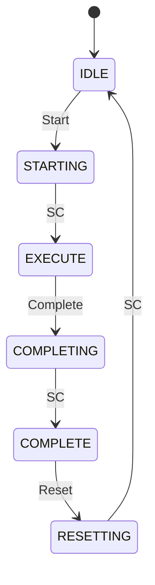

# GSD-Docs Industrial - Framework Specification

**Versie:** 2.7.0  
**Datum:** 2026-02-06  
**Status:** SSOT (Single Source of Truth)  
**Gebaseerd op:** [Get Shit Done (GSD)](https://github.com/glittercowboy/get-shit-done)

---

## Documentgeschiedenis

| Versie | Datum | Wijzigingen |
|--------|-------|-------------|
| 2.7.0 | 2026-02-06 | Error recovery toegevoegd (§9.7) |
| 2.6.0 | 2026-02-06 | Cross-reference beheer toegevoegd (§9.6) |
| 2.5.0 | 2026-02-06 | Diagram types + ENGINEER-TODO.md toegevoegd (§8.2) |
| 2.4.0 | 2026-02-06 | SUMMARY.md doel en formaat toegevoegd (§4.4) |
| 2.3.0 | 2026-02-06 | Versioning strategie toegevoegd (§9.5) |
| 2.2.0 | 2026-02-06 | Kennisoverdracht timing toegevoegd (§9.4) |
| 2.1.0 | 2026-02-05 | Dynamische ROADMAP evolutie voor grote projecten (§3.5) |
| 2.0.0 | 2026-02-05 | Complete herschrijving gebaseerd op GSD workflow |
| 1.4.0 | 2026-02-05 | discuss-phase toegevoegd |
| 1.3.0 | 2026-02-05 | Gefaseerde deployment |
| 1.0.0 | 2026-02-04 | Initiële SSOT |

---

## 1. Executive Summary

### 1.1 Wat is GSD-Docs?

GSD-Docs is een **1-op-1 mapping van GSD naar documentatie**. Dezelfde workflow die GSD gebruikt voor code, gebruiken wij voor FDS/SDS documenten.

```
GSD (code)                    GSD-Docs (documentatie)
─────────────────────────────────────────────────────
/gsd:new-project         →    /doc:new-fds
/gsd:discuss-phase N     →    /doc:discuss-phase N
/gsd:plan-phase N        →    /doc:plan-phase N
/gsd:execute-phase N     →    /doc:write-phase N
/gsd:verify-phase N      →    /doc:verify-phase N
/gsd:verify-work N       →    /doc:review-phase N
/gsd:complete-milestone  →    /doc:complete-fds
-                        →    /doc:generate-sds
-                        →    /doc:export
```

### 1.2 Kernprincipes

1. **GSD workflow** - Bewezen systeem, niet opnieuw uitvinden
2. **Verse context per taak** - Geen context pollution
3. **Goal-backward verification** - Doelen bereikt, niet alleen taken voltooid
4. **Gap closure loop** - Verificatie vindt gaps → fix → re-verify
5. **4 project types** - Structuur past zich aan aan project
6. **Standaarden als opt-in** - PackML, ISA-88 nooit gepusht

### 1.3 Deployment

```
┌─────────────────────────────────────────────────────────────────────┐
│  FASE 1: CLAUDE CODE PLUGIN (nu)                                    │
│  • Custom commands in Claude Code                                   │
│  • Claude API (Opus/Sonnet), 200K context                          │
│  • Geen hardware investering                                        │
├─────────────────────────────────────────────────────────────────────┤
│  FASE 2: LOKAAL (later, optioneel)                                  │
│  • Mac Studio M3 Ultra 512GB + Llama 405B                          │
│  • 100% air-gapped voor gevoelige klantdata                        │
└─────────────────────────────────────────────────────────────────────┘
```

---

## 2. Complete Workflow

### 2.1 Flow Diagram

```
┌─────────────────────────────────────────────────────────────────────────────┐
│                           GSD-DOCS WORKFLOW                                  │
└─────────────────────────────────────────────────────────────────────────────┘

/doc:new-fds
    │
    ├── Classificatie (Type A/B/C/D)
    ├── PROJECT.md
    ├── REQUIREMENTS.md
    └── ROADMAP.md (fases gebaseerd op type)
    │
    ▼
┌─────────────────────────────────────────────────────────────────────────────┐
│  PER FASE:                                                                   │
│                                                                              │
│  /doc:discuss-phase N ──▶ phase-N/CONTEXT.md (gray areas)                   │
│           │                                                                  │
│           ▼                                                                  │
│  /doc:plan-phase N ────▶ phase-N/*-PLAN.md (section plans)                  │
│           │                                                                  │
│           ▼                                                                  │
│  /doc:write-phase N ───▶ phase-N/*-CONTENT.md, *-SUMMARY.md                 │
│           │                                                                  │
│           ▼                                                                  │
│  /doc:verify-phase N ──▶ phase-N/VERIFICATION.md                            │
│           │                                                                  │
│           ├── PASS ──▶ Volgende fase                                        │
│           └── GAPS ──▶ /doc:plan-phase N --gaps ──▶ fix ──▶ re-verify      │
│                                                                              │
│  /doc:review-phase N ──▶ phase-N/REVIEW.md (optioneel, met klant)           │
│                                                                              │
└─────────────────────────────────────────────────────────────────────────────┘
    │
    ▼ (na alle fases)
/doc:complete-fds
    │
    ├── Samenvoeging tot FDS-[Project]-v[X.Y].md
    ├── Cross-fase verificatie
    └── Archivering
    │
    ▼
/doc:generate-sds
    │
    ├── FDS → SDS transformatie
    ├── Typicals matching (CATALOG.json)
    └── SDS-[Project]-v[X.Y].md + TRACEABILITY.md
    │
    ▼
/doc:export --format docx
    │
    ├── Mermaid → PNG rendering
    ├── Pandoc + huisstijl.docx
    └── export/*.docx
```

### 2.2 State Management

Net als GSD gebruikt GSD-Docs `STATE.md` voor progress tracking:

```markdown
# STATE.md

## Current Position
- Phase: 2 (Equipment Modules)
- Plan: 02-03 (EM-300 Vulunit)
- Status: writing

## Completed
- Phase 1: ✓ (all plans complete, verified)
- Phase 2: 02-01 ✓, 02-02 ✓, 02-03 in progress

## Decisions
- PackML enabled (decided in discuss-fds)
- Settling time = 3s (decided in discuss-phase 2)

## Blockers
- Wacht op capaciteit info voor EM-400
```

---

## 3. Project Types

### 3.1 Classificatie

```
/doc:new-fds vraagt:

Nieuw of Modificatie?
├── NIEUW → Standaarden vereist?
│   ├── Ja  → TYPE A (Nieuwbouw + Standaarden)
│   └── Nee → TYPE B (Nieuwbouw Flex)
└── MODIFICATIE → Omvang?
    ├── Substantieel → TYPE C (Modificatie Groot)
    └── Beperkt      → TYPE D (Modificatie Klein / TWN)
```

### 3.2 Type Overzicht

| Type | Beschrijving | ROADMAP Fases | Template |
|------|--------------|---------------|----------|
| **A** | Nieuwbouw + Standaarden | 6 fases | fds-nieuwbouw-standaard |
| **B** | Nieuwbouw Flex | 4-5 fases | fds-nieuwbouw-flex |
| **C** | Modificatie Groot | 3-4 fases | fds-modificatie |
| **D** | Modificatie Klein | 2 fases | twn-template |

### 3.3 ROADMAP Templates

**Type A - Nieuwbouw + Standaarden:**
```markdown
# ROADMAP.md

## Phase 1: Foundation
- Introductie, definities, referenties
- Standaarden scope (PackML, ISA-88)

## Phase 2: System Architecture  
- Systeem overzicht
- Equipment hiërarchie (ISA-88)
- Operating modes (PackML)

## Phase 3: Equipment Modules
- Per EM: beschrijving, states, parameters, interlocks
- (Grootste fase, meeste secties)

## Phase 4: Control & HMI
- Control philosophy
- HMI requirements
- Scherm beschrijvingen

## Phase 5: Interfaces & Safety
- Externe interfaces
- Safety requirements
- Interlocks overzicht

## Phase 6: Appendices
- Signaallijst
- Parameterlijst
- State transition tables
```

**Type B - Nieuwbouw Flex:**
```markdown
# ROADMAP.md

## Phase 1: Foundation
- Introductie, definities
- Scope en grenzen
- (Geen standaarden sectie)

## Phase 2: System Overview
- Systeem beschrijving
- Functionele blokken
- Proces flow

## Phase 3: Functional Units
- Per unit: beschrijving, werking, parameters
- Interlocks en condities
- (Flexibele structuur, geen ISA-88 hiërarchie)

## Phase 4: HMI & Interfaces
- Bediening
- Externe koppelingen
- Communicatie

## Phase 5: Appendices (optioneel)
- Signaallijst
- Parameterlijst
```

**Type C - Modificatie Groot:**
```markdown
# ROADMAP.md

## Phase 1: Scope & Baseline
- Wijzigingsomschrijving
- BASELINE.md referentie
- Wat wijzigt WEL / NIET

## Phase 2: Delta Functioneel
- Gewijzigde functionaliteit
- Nieuwe equipment/functies
- Impact op bestaand systeem

## Phase 3: Delta HMI & Interfaces
- Gewijzigde schermen
- Nieuwe schermen
- Interface wijzigingen

## Phase 4: Verificatie & Appendices
- Test criteria
- Regressie check
- Bijgewerkte signaallijst (delta)
```

**Type D - Modificatie Klein (TWN):**
```markdown
# ROADMAP.md

## Phase 1: Wijziging
- Wijzigingsomschrijving
- Aanleiding
- Scope (in/uit)

## Phase 2: Implementatie
- Technische wijzigingen
- Impact analyse
- Test criteria
```

### 3.4 BASELINE.md (Type C/D)

Voor modificaties wordt het bestaande systeem vastgelegd:

```markdown
# BASELINE.md

**Bestaand systeem:** SCADA Productielijn v3.2
**Baseline datum:** 2026-02-05

## ⚠️ INSTRUCTIE
Dit beschrijft het BESTAANDE systeem.
AI MOET:
- Dit als gegeven beschouwen
- Alleen de DELTA beschrijven
- NIET suggereren bestaande functionaliteit te herschrijven

## Bestaande Equipment
- EM-100: Intake (ONGEWIJZIGD)
- EM-200: Mixing (WORDT GEWIJZIGD)
- EM-300: Output (ONGEWIJZIGD)

## Scope Modificatie
### Wijzigt
- EM-200: Nieuwe mixer motor
- HMI: Aangepast scherm voor EM-200

### Wijzigt NIET
- EM-100, EM-300
- Bestaande interlocks
- Communicatie protocollen
```

### 3.5 Dynamische ROADMAP Evolutie

**Probleem:** Bij grote projecten (20+ units, 100 motoren) is een statische fase zoals "Functional Units" niet werkbaar. Een `discuss-phase` met 60+ gray area vragen is onbeheersbaar.

**Oplossing:** De ROADMAP evolueert na de System Overview fase. Units worden gegroepeerd in behapbare fases.

#### 3.5.1 Wanneer ROADMAP Uitbreiden?

Na het afronden van de **System Overview fase** (Type A: fase 2, Type B: fase 2):

```
/doc:complete-phase 2

Systeem analyseert CONTENT.md van System Overview:
├── Identificeert functionele gebieden / unit groepen
├── Telt units per groep
│
└── Beslissing:
    ├── ≤5 units totaal → Statische ROADMAP behouden
    └── >5 units totaal → ROADMAP uitbreiden
```

#### 3.5.2 Groepering Logica

Units worden gegroepeerd op basis van:

1. **Functioneel gebied** (primair)
   - Intake, Processing, Output, Utilities, etc.
   
2. **Proces volgorde** (secundair)
   - Units die sequentieel werken samen

3. **Maximaal per fase**
   - Target: 3-5 units per fase
   - Maximum: 7 units per fase
   - Reden: discuss-phase blijft behapbaar (15-25 vragen)

#### 3.5.3 Voorbeeld: ROADMAP Evolutie

**Initiële ROADMAP (Type B):**
```markdown
## Phase 1: Foundation
## Phase 2: System Overview
## Phase 3: Functional Units    ← placeholder
## Phase 4: HMI & Interfaces
## Phase 5: Appendices
```

**Na /doc:complete-phase 2:**

System Overview identificeert 18 units in 5 gebieden:
- Intake (3 units)
- Mixing (4 units)
- Transport (4 units)
- Filling (4 units)
- Packaging (3 units)

**Uitgebreide ROADMAP:**
```markdown
## Phase 1: Foundation ✓
## Phase 2: System Overview ✓
## Phase 3: Intake Sectie (3 units)
   - Hopper feed
   - Weigh station
   - Conveyor infeed
## Phase 4: Mixing Sectie (4 units)
   - Pre-mixer
   - Main mixer
   - Holding tank
   - Transfer pump
## Phase 5: Transport Sectie (4 units)
   - Conveyor main
   - Diverter gates
   - Buffer station
   - Elevator
## Phase 6: Filling Sectie (4 units)
   - Filling head 1-2
   - Cap placer
   - Cap torquer
   - Reject station
## Phase 7: Packaging Sectie (3 units)
   - Case packer
   - Label applicator
   - Palletizer
## Phase 8: HMI & Interfaces
## Phase 9: Appendices
```

**Voordelen:**
- Elke `discuss-phase` behandelt 3-5 units (behapbaar)
- `verify-phase` per sectie (niet 18 units tegelijk)
- Logische groepering voor klant/engineer review

#### 3.5.4 User Interactie

```
> /doc:complete-phase 2

✓ Phase 2 (System Overview) afgerond

📊 Analyse van je systeem:
   18 units geïdentificeerd in 5 functionele gebieden

┌────────────────────────────────────────────────────────────┐
│ Gebied          │ Units │ Voorgestelde fase               │
├────────────────────────────────────────────────────────────┤
│ Intake          │ 3     │ Phase 3                         │
│ Mixing          │ 4     │ Phase 4                         │
│ Transport       │ 4     │ Phase 5                         │
│ Filling         │ 4     │ Phase 6                         │
│ Packaging       │ 3     │ Phase 7                         │
├────────────────────────────────────────────────────────────┤
│ HMI & Interfaces│ -     │ Phase 8                         │
│ Appendices      │ -     │ Phase 9                         │
└────────────────────────────────────────────────────────────┘

Wil je deze structuur gebruiken? (ja / aanpassen)
> ja

✓ ROADMAP.md bijgewerkt (9 fases)
✓ STATE.md bijgewerkt

Volgende stap: /doc:discuss-phase 3 (Intake Sectie)
```

#### 3.5.5 Handmatig Aanpassen

Als de automatische groepering niet past:

```
> aanpassen

Welke wijziging?
1. Gebieden samenvoegen (bijv. Intake + Transport)
2. Gebieden splitsen (bijv. Filling → Filling + QC)
3. Units verplaatsen tussen gebieden
4. Eigen groepering opgeven

> 1

Welke gebieden samenvoegen?
> Intake en Transport → "Material Handling"

✓ ROADMAP.md bijgewerkt:
  - Phase 3: Material Handling (7 units)
  - Phase 4: Mixing Sectie (4 units)
  - ...
```

#### 3.5.6 Kleine Projecten

Bij projecten met ≤5 units wordt de ROADMAP NIET uitgebreid:

```
> /doc:complete-phase 2

✓ Phase 2 (System Overview) afgerond

📊 Analyse: 4 units geïdentificeerd
   → Statische ROADMAP behouden (fase 3 = alle units)

Volgende stap: /doc:discuss-phase 3 (Functional Units)
```

#### 3.5.7 Impact op Andere Types

| Type | Evolutie Trigger | Groepering |
|------|------------------|------------|
| **A** | Na Phase 2 (System Architecture) | Per EM groep |
| **B** | Na Phase 2 (System Overview) | Per functioneel gebied |
| **C** | Na Phase 1 (Scope) | Per wijzigingsgebied |
| **D** | Nooit (te klein) | Statisch |

**Type C - Modificatie Groot (voorbeeld):**

```
verify-phase 1 (Scope & Baseline) → PASS
    │
    ├── Analyseert BASELINE.md + scope
    │   - 3 equipment modules worden gewijzigd
    │   - 2 nieuwe modules toegevoegd
    │   - HMI impact op 4 schermen
    │
    └── ROADMAP wordt uitgebreid:
        Phase 2: Wijzigingen EM-200 (bestaand)
        Phase 3: Wijzigingen EM-400, EM-500 (bestaand)
        Phase 4: Nieuwe modules EM-700, EM-800
        Phase 5: HMI Delta (4 schermen)
        Phase 6: Verificatie & Regressie
```

**Groepering logica Type C:**
- Bestaande wijzigingen per impact-grootte
- Nieuwe modules apart
- HMI altijd eigen fase bij >2 schermen
- Verificatie & regressie altijd laatste fase

---

## 4. Commands Reference

### 4.1 /doc:new-fds

**Doel:** Start nieuw FDS project, classificeer, genereer ROADMAP.

**Equivalent:** `/gsd:new-project`

**Proces:**
1. Vraag project beschrijving
2. Classificeer (Type A/B/C/D)
3. Vraag standaarden (PackML, ISA-88)
4. Voor modificaties: genereer BASELINE.md
5. Genereer ROADMAP.md gebaseerd op type
6. Genereer PROJECT.md en REQUIREMENTS.md

**Output:**
```
.planning/
├── PROJECT.md        # Project configuratie
├── REQUIREMENTS.md   # Functionele requirements
├── ROADMAP.md        # Fases en doelen
├── BASELINE.md       # (Type C/D only)
└── STATE.md          # Progress tracking
```

**Voorbeeld:**
```
> /doc:new-fds "Extrusie Lijn Klant XYZ"

📋 Project Classificatie

Vraag 1: Nieuw systeem of modificatie?
> Nieuw systeem

Vraag 2: Zijn standaarden vereist?
> Ja, PackML + ISA-88

Vraag 3: Hoeveel equipment modules (schatting)?
> 6 stuks

╔════════════════════════════════════════════════════════════╗
║  PROJECT TYPE: A (Nieuwbouw + Standaarden)                 ║
║  Template: fds-nieuwbouw-standaard                         ║
║  Fases: 6                                                  ║
║  Standaarden: PackML ✓, ISA-88 ✓                          ║
╚════════════════════════════════════════════════════════════╝

✓ PROJECT.md gegenereerd
✓ REQUIREMENTS.md gegenereerd  
✓ ROADMAP.md gegenereerd (6 fases)
✓ STATE.md geïnitialiseerd

Volgende stap: /doc:discuss-phase 1
```

---

### 4.2 /doc:discuss-phase [N]

**Doel:** Identificeer gray areas voor fase N, leg beslissingen vast.

**Equivalent:** `/gsd:discuss-phase`

**Filosofie:** (Overgenomen van GSD)
> "User = founder/visionary. Claude = builder. Capture decisions clearly enough that downstream agents can act on them without asking the user again."

**Proces:**
1. Lees ROADMAP.md voor fase doelen
2. Identificeer gray areas specifiek voor deze fase
3. Stel gerichte vragen
4. Leg beslissingen vast in CONTEXT.md

**Gray Areas per Fase Type:**

| Fase Inhoud | Gray Areas |
|-------------|------------|
| Equipment Modules | Capaciteiten, toleranties, failure modes, timing |
| Interfaces | Protocollen, polling rates, error handling |
| HMI | Layout, navigatie, user flows, alarm presentatie |
| Safety | Risico categorieën, interlock prioriteiten |

**Output:**
```
.planning/phases/phase-N/CONTEXT.md
```

**Voorbeeld:**
```
> /doc:discuss-phase 3

📋 Phase 3: Equipment Modules

Gray areas geïdentificeerd:

┌────────────────────────────────────────────────────────────┐
│ 1. EM-100 Waterbad                                         │
│    • Tank capaciteit?                                      │
│    • Automatisch bijvullen of handmatig?                  │
│    • Wat bij temp sensor failure?                         │
│                                                            │
│ 2. EM-200 Bovenloopkraan                                  │
│    • Maximale last?                                        │
│    • Collision detection vereist?                         │
│    • Gedrag bij E-stop tijdens beweging?                  │
│                                                            │
│ 3. Algemeen                                                │
│    • Timeout waarden voor state transitions?              │
│    • Standaard alarm delays?                              │
└────────────────────────────────────────────────────────────┘

Welke wil je bespreken? (nummer of 'all')
> all

Vraag 1.1: Tank capaciteit waterbad?
> 2000 liter

Vraag 1.2: Automatisch bijvullen?
> Ja, via niveau sensor en magneetklep

...

✓ phases/phase-3/CONTEXT.md gegenereerd
  • 12 beslissingen vastgelegd
  • 3 items gemarkeerd als "Claude's Discretion"

Volgende stap: /doc:plan-phase 3
```

---

### 4.3 /doc:plan-phase [N]

**Doel:** Genereer section plans voor fase N.

**Equivalent:** `/gsd:plan-phase` (research + planning)

**Proces:**
1. Lees CONTEXT.md voor beslissingen
2. Optioneel: research (standaarden, typicals)
3. Genereer PLAN.md per sectie
4. Bepaal wave assignments voor parallel schrijven
5. Verify plans (self-check)

**Plan Structuur:** (Overgenomen van GSD)
```markdown
---
phase: 3
plan: 02
name: EM-200 Bovenloopkraan
wave: 1
autonomous: true
---

# EM-200 Bovenloopkraan

## Goal
Volledige beschrijving van de bovenloopkraan inclusief states, 
parameters, en interlocks.

## Sections
1. Beschrijving en functie
2. Operating states (PackML)
3. Parameters
4. Interlocks
5. Interfaces (I/O)

## Context
- Max last: 500 kg (uit CONTEXT.md)
- Collision detection: niet vereist
- E-stop gedrag: controlled stop, positie behouden

## Standards
- PackML states verplicht
- ISA-88 terminologie

## Verification
- [ ] Alle states beschreven met entry/exit conditions
- [ ] Alle parameters hebben bereik en eenheid
- [ ] Alle interlocks hebben conditie en actie
- [ ] I/O lijst compleet
```

**Output:**
```
.planning/phases/phase-N/
├── 03-01-PLAN.md
├── 03-02-PLAN.md
├── 03-03-PLAN.md
└── ...
```

---

### 4.4 /doc:write-phase [N]

**Doel:** Schrijf alle secties van fase N.

**Equivalent:** `/gsd:execute-phase`

**Proces:**
1. Discover plans in fase
2. Analyseer dependencies
3. Groepeer in waves
4. Per wave: spawn parallel writers met verse context
5. Per plan: schrijf CONTENT.md + SUMMARY.md
6. Git commit per plan (optioneel)

**Verse Context per Sectie:**
```
┌─────────────────────────────────────────────────┐
│ GELADEN:                                        │
│ ✓ PROJECT.md                                    │
│ ✓ phases/phase-N/CONTEXT.md                    │
│ ✓ phases/phase-N/03-02-PLAN.md                 │
│ ✓ Standards (indien enabled)                    │
│                                                 │
│ NIET GELADEN:                                   │
│ ✗ Andere PLAN.md files                         │
│ ✗ Andere CONTENT.md files                      │
│ ✗ Vorige conversatie                           │
└─────────────────────────────────────────────────┘
```

**Output:**
```
.planning/phases/phase-N/
├── 03-01-PLAN.md
├── 03-01-CONTENT.md    ← geschreven
├── 03-01-SUMMARY.md    ← geschreven
├── 03-02-PLAN.md
├── 03-02-CONTENT.md    ← geschreven
├── 03-02-SUMMARY.md    ← geschreven
└── ...
```

**SUMMARY.md - Doel en Formaat:**

SUMMARY.md is een **compacte samenvatting voor AI-agents**. Het stelt andere agents in staat snel te begrijpen wat in een sectie staat, zonder de volledige CONTENT.md te laden. Dit bespaart tokens bij cross-reference checks en verificatie.

```markdown
# SUMMARY: 03-02 EM-200 Bovenloopkraan

## Feiten
- Type: Equipment Module
- States: 6 (PackML compliant)
- Parameters: 4
- Interlocks: 3
- I/O: 8 DI, 4 DO, 2 AI

## Key Decisions
- Geen collision detection (klant keuze)
- E-stop = controlled stop, positie behouden
- Max last 500 kg

## Dependencies
- Interlock met EM-100 (waterbad niveau)
- Interface naar SCADA via Modbus TCP

## Cross-refs
- Interlock IL-200-01 → zie §6.3
- HMI scherm → zie phase-4/04-02
```

**Regels:**
- Max 150 woorden
- Alleen feiten, geen proza
- Altijd Key Decisions opnemen
- Dependencies naar andere secties expliciet

**Voorbeeld:**
```
> /doc:write-phase 3

📝 Phase 3: Equipment Modules

Plans gevonden: 6
Waves: 3

Wave 1 (parallel):
  • 03-01 EM-100 Waterbad
  • 03-02 EM-200 Bovenloopkraan

Spawning writers...
  ✓ 03-01 complete (2.3KB)
  ✓ 03-02 complete (1.8KB)

Wave 2 (parallel):
  • 03-03 EM-300 Vulunit
  • 03-04 EM-400 Losunit

Spawning writers...
  ✓ 03-03 complete (2.1KB)
  ✓ 03-04 complete (1.9KB)

Wave 3:
  • 03-05 EM-500 Kettingbaan
  • 03-06 EM-600 Algemene Interlocks

Spawning writers...
  ✓ 03-05 complete (1.5KB)
  ✓ 03-06 complete (2.0KB)

═══════════════════════════════════════════════════
Phase 3 schrijven compleet: 6/6 plans
Totaal: 11.6KB content gegenereerd
═══════════════════════════════════════════════════

Volgende stap: /doc:verify-phase 3
```

---

### 4.5 /doc:verify-phase [N]

**Doel:** Goal-backward verification voor fase N.

**Equivalent:** `/gsd:verify-phase`

**Core Principle:** (Overgenomen van GSD)
> "Task completion ≠ Goal achievement. A section can be written but the GOAL not achieved."

**Proces:**
1. Lees fase doelen uit ROADMAP.md
2. Voor elk doel: wat moet TRUE zijn?
3. Verify truths tegen CONTENT.md files
4. Check artifacts: bestaan, substantive (niet stub), wired
5. Identificeer gaps
6. Genereer VERIFICATION.md

**Verification Levels:**

| Level | Check |
|-------|-------|
| Exists | Is de sectie geschreven? |
| Substantive | Is het echte content of een stub/placeholder? |
| Complete | Zijn alle vereiste onderdelen aanwezig? |
| Consistent | Klopt het met CONTEXT.md beslissingen? |
| Standards | Voldoet het aan PackML/ISA-88 (indien enabled)? |

**Output:**
```
.planning/phases/phase-N/VERIFICATION.md
```

**Voorbeeld:**
```
> /doc:verify-phase 3

🔍 Verificatie Phase 3: Equipment Modules

Goal: "Alle equipment modules volledig beschreven met states, 
       parameters, interlocks, en interfaces"

═══════════════════════════════════════════════════════════════
MUST-HAVES VERIFICATION
═══════════════════════════════════════════════════════════════

┌──────────────────────────────────────────────────────────────┐
│ Truth                              │ Status │ Evidence      │
├──────────────────────────────────────────────────────────────┤
│ Alle 6 EM's hebben state tables    │ ✓ PASS │ 03-01..06     │
│ Alle states zijn PackML compliant  │ ✓ PASS │ Spot checked  │
│ Alle parameters hebben bereik      │ ⚠ GAP  │ 03-04 mist 2  │
│ Alle interlocks beschreven         │ ✓ PASS │ 03-06         │
│ I/O lijsten compleet               │ ⚠ GAP  │ 03-02 mist DO │
└──────────────────────────────────────────────────────────────┘

═══════════════════════════════════════════════════════════════
GAPS GEVONDEN
═══════════════════════════════════════════════════════════════

1. 03-04 EM-400 Losunit
   - Parameter "LOS_TIMEOUT" mist bereik
   - Parameter "LOS_SPEED" mist eenheid

2. 03-02 EM-200 Bovenloopkraan
   - I/O lijst mist DO-200-03 (rem release)

═══════════════════════════════════════════════════════════════
RESULTAAT: GAPS_FOUND
═══════════════════════════════════════════════════════════════

Aanbevolen: /doc:plan-phase 3 --gaps

Dit genereert fix plans voor de gevonden gaps.
```

**Bij GAPS_FOUND:**
```
> /doc:plan-phase 3 --gaps

📝 Gap Closure Plans

Generating fix plans from VERIFICATION.md...

✓ 03-04-fix-PLAN.md: Add parameter ranges to EM-400
✓ 03-02-fix-PLAN.md: Add missing I/O to EM-200

Run /doc:write-phase 3 to execute fix plans.
```

**Bij PASS + System Overview fase → ROADMAP Evolutie:**

Wanneer verify-phase PASS geeft op een System Overview fase (Type A fase 2, Type B fase 2), wordt automatisch gecheckt of de ROADMAP moet worden uitgebreid:

```
> /doc:verify-phase 2

🔍 Verificatie Phase 2: System Overview

═══════════════════════════════════════════════════════════════
RESULTAAT: PASS
═══════════════════════════════════════════════════════════════

📊 ROADMAP Evolutie Check...

Systeem analyse van System Overview content:
├── 18 units geïdentificeerd
├── 5 functionele gebieden gevonden
└── Threshold (>5 units) overschreden

┌────────────────────────────────────────────────────────────┐
│ Voorstel: ROADMAP uitbreiden naar 9 fases                 │
├────────────────────────────────────────────────────────────┤
│ Phase 3: Intake (3 units)                                 │
│ Phase 4: Mixing (4 units)                                 │
│ Phase 5: Transport (4 units)                              │
│ Phase 6: Filling (4 units)                                │
│ Phase 7: Packaging (3 units)                              │
│ Phase 8: HMI & Interfaces                                 │
│ Phase 9: Appendices                                       │
└────────────────────────────────────────────────────────────┘

Accepteren? (ja / aanpassen / nee)
> ja

✓ ROADMAP.md bijgewerkt (9 fases)
✓ STATE.md bijgewerkt

Volgende stap: /doc:discuss-phase 3 (Intake)
```

Zie **sectie 3.5 Dynamische ROADMAP Evolutie** voor details.

---

### 4.6 /doc:review-phase [N]

**Doel:** Review met klant/engineer (UAT equivalent).

**Equivalent:** `/gsd:verify-work`

**Wanneer:** Optioneel, na verify-phase PASS.

**Proces:**
1. Presenteer CONTENT per sectie
2. Vraag: "Klopt dit? Iets aan te passen?"
3. Log feedback in REVIEW.md
4. Bij issues: terug naar plan-phase --gaps

**Output:**
```
.planning/phases/phase-N/REVIEW.md
```

---

### 4.7 /doc:complete-fds

**Doel:** Voeg alle fases samen tot definitief FDS document.

**Equivalent:** `/gsd:complete-milestone`

**Proces:**
1. Verify alle fases PASS
2. Concatenate alle CONTENT.md files
3. Genereer cross-references
4. Cross-fase verificatie
5. Genereer FDS-[Project]-v[X.Y].md
6. Archiveer fase files
7. Update STATE.md

**Output:**
```
output/
├── FDS-[Project]-v[X.Y].md
├── RATIONALE.md
└── EDGE-CASES.md

.planning/archive/
└── v1.0/
    ├── ROADMAP.md
    ├── REQUIREMENTS.md
    └── phases/
```

---

### 4.8 /doc:generate-sds

**Doel:** Transformeer FDS naar SDS met typicals matching.

**Proces:**
1. Lees FDS.md
2. Per equipment: match met CATALOG.json
3. Genereer SDS secties
4. Bij geen match: flag als "NEW TYPICAL NEEDED"
5. Genereer TRACEABILITY.md

**Output:**
```
output/
├── SDS-[Project]-v[X.Y].md
└── TRACEABILITY.md
```

---

### 4.9 /doc:export

**Doel:** Exporteer naar DOCX met huisstijl.

**Syntax:**
```bash
/doc:export [--format docx] [--draft] [--skip-diagrams]
```

**Proces:**
1. Render mermaid diagrams → PNG
2. Pandoc convert met huisstijl.docx
3. Embed diagrams

**Output:**
```
export/
├── FDS-[Project]-v[X.Y].docx
├── SDS-[Project]-v[X.Y].docx
└── assets/
    └── diagrams/*.png
```

---

### 4.10 /doc:status

**Doel:** Toon huidige project status en progress.

**Proces:**
1. Lees STATE.md voor huidige positie
2. Lees ROADMAP.md voor fase overzicht
3. Scan phases/ folders voor completion status
4. Toon overzicht

**Output:**
```
> /doc:status

📊 Project: Extrusie Lijn Klant XYZ
   Type: A (Nieuwbouw + Standaarden)
   Created: 2026-02-05

┌─────────────────────────────────────────────────────────────┐
│ FASE              │ STATUS      │ PROGRESS                 │
├─────────────────────────────────────────────────────────────┤
│ 1. Foundation     │ ✓ COMPLETE  │ verified                 │
│ 2. Architecture   │ ✓ COMPLETE  │ verified                 │
│ 3. Intake         │ ✓ COMPLETE  │ verified                 │
│ 4. Mixing         │ 🔄 ACTIVE   │ write done, verify next  │
│ 5. Transport      │ ○ PENDING   │                          │
│ 6. Filling        │ ○ PENDING   │                          │
│ 7. Packaging      │ ○ PENDING   │                          │
│ 8. HMI            │ ○ PENDING   │                          │
│ 9. Appendices     │ ○ PENDING   │                          │
└─────────────────────────────────────────────────────────────┘

Progress: 4/9 fases (44%)

Volgende stap: /doc:verify-phase 4
```

---

### 4.11 /doc:resume

**Doel:** Hervat werk na onderbreking. Leest STATE.md en biedt opties.

**Wanneer:** Na /clear, nieuwe sessie, of lange pauze.

**Proces:**
1. Lees STATE.md voor laatste positie
2. Bepaal waar gestopt was
3. Bied opties aan
4. Laad relevante context bij hervatting

**Output:**
```
> /doc:resume

🔄 Project: Extrusie Lijn Klant XYZ

Laatste activiteit: 2026-02-04 16:30
Gestopt bij: write-phase 4, wave 2 (2/3 plans complete)

┌─────────────────────────────────────────────────────────────┐
│ OPTIES                                                      │
├─────────────────────────────────────────────────────────────┤
│ 1. Hervat write-phase 4 (wave 2 → wave 3)                  │
│ 2. Bekijk status eerst (/doc:status)                       │
│ 3. Start andere fase                                        │
└─────────────────────────────────────────────────────────────┘

Keuze? (1/2/3)
> 1

✓ Context geladen voor write-phase 4
  Hervatting bij wave 3 (1 plan remaining)
```

**Leest:** STATE.md
**Update:** STATE.md (last_resumed timestamp)

---

## 5. Folder Structure

### 5.1 Framework (in repository)

```
gsd-docs-industrial/
├── workflows/                       # Command definities
│   ├── new-fds.md
│   ├── discuss-phase.md
│   ├── plan-phase.md
│   ├── write-phase.md
│   ├── verify-phase.md
│   ├── review-phase.md
│   ├── complete-fds.md
│   ├── generate-sds.md
│   └── export.md
│
├── templates/
│   ├── roadmap/
│   │   ├── type-a-nieuwbouw-standaard.md
│   │   ├── type-b-nieuwbouw-flex.md
│   │   ├── type-c-modificatie.md
│   │   └── type-d-twn.md
│   ├── fds/
│   │   ├── section-equipment-module.md
│   │   ├── section-state-machine.md
│   │   └── section-interface.md
│   ├── project.md
│   ├── requirements.md
│   ├── context.md
│   ├── plan.md
│   ├── verification-report.md
│   └── huisstijl.docx
│
├── references/
│   ├── standards/
│   │   ├── packml/
│   │   │   ├── STATE-MODEL.md
│   │   │   └── UNIT-MODES.md
│   │   └── isa-88/
│   │       ├── EQUIPMENT-HIERARCHY.md
│   │       └── TERMINOLOGY.md
│   ├── typicals/
│   │   ├── CATALOG.json
│   │   └── library/
│   ├── verification-patterns.md
│   └── writing-guidelines.md
│
└── CLAUDE-CONTEXT.md
```

#### 5.1.1 FDS Section Templates

**templates/fds/section-equipment-module.md:**

```markdown
---
type: equipment-module
standards: [packml, isa88]
---

### [N.M] {EM_ID}: {EM_NAME}

#### [N.M.1] Beschrijving
{Functie en werking van deze equipment module}

#### [N.M.2] Operating States
| State | ID | Beschrijving | Entry Conditie | Exit Conditie |
|-------|-----|--------------|----------------|---------------|
| IDLE | 4 | In rust | Reset complete | START cmd |
| STARTING | 3 | Opstarten | START cmd | Opstartcondities OK |
| EXECUTE | 6 | In bedrijf | Opstartcondities OK | COMPLETE cmd |

#### [N.M.3] Parameters
| Parameter | Bereik | Eenheid | Default | Beschrijving |
|-----------|--------|---------|---------|--------------|
| {PARAM} | {MIN}-{MAX} | {UNIT} | {DEF} | {DESC} |

#### [N.M.4] Interlocks
| ID | Conditie | Actie | Prioriteit |
|----|----------|-------|------------|
| IL-{EM}-01 | {CONDITIE} | {ACTIE} | {PRIO} |

#### [N.M.5] Interfaces
| Tag | Type | Beschrijving |
|-----|------|--------------|
| {TAG} | DI/DO/AI/AO | {DESC} |
```

**templates/fds/section-state-machine.md:**

```markdown
---
type: state-machine
standards: [packml]
---

### [N.M] State Machine: {UNIT_NAME}

#### [N.M.1] State Diagram



#### [N.M.2] State Descriptions
| State | Beschrijving | Acties |
|-------|--------------|--------|
| IDLE | Machine in rust, klaar voor start | Geen actieve aandrijvingen |
| EXECUTE | Productie actief | {ACTIES} |

#### [N.M.3] Transitions
| Van | Naar | Trigger | Condities |
|-----|------|---------|-----------|
| IDLE | STARTING | START cmd | Geen fouten actief |
```

**templates/fds/section-interface.md:**

```markdown
---
type: interface
---

### [N.M] Interface: {INTERFACE_NAME}

#### [N.M.1] Overzicht
| Eigenschap | Waarde |
|------------|--------|
| Type | {Modbus TCP / Profinet / OPC-UA / ...} |
| Richting | {Inkomend / Uitgaand / Bidirectioneel} |
| Tegenpartij | {SYSTEEM_NAAM} |

#### [N.M.2] Signalen
| # | Naam | Type | Beschrijving | Richting |
|---|------|------|--------------|----------|
| 1 | {SIGNAL} | {BOOL/INT/REAL} | {DESC} | {IN/OUT} |

#### [N.M.3] Protocol Details
- Polling interval: {X} ms
- Timeout: {Y} ms
- Error handling: {BESCHRIJVING}
```

### 5.2 Project Folder (per project)

```
extrusie-lijn-klant-xyz/
├── .planning/
│   ├── PROJECT.md
│   ├── REQUIREMENTS.md
│   ├── ROADMAP.md
│   ├── BASELINE.md              # (Type C/D only)
│   ├── STATE.md
│   ├── config.json              # Planning settings
│   │
│   ├── phases/
│   │   ├── 01-foundation/
│   │   │   ├── CONTEXT.md
│   │   │   ├── 01-01-PLAN.md
│   │   │   ├── 01-01-CONTENT.md
│   │   │   ├── 01-01-SUMMARY.md
│   │   │   └── VERIFICATION.md
│   │   │
│   │   ├── 02-architecture/
│   │   │   ├── CONTEXT.md
│   │   │   ├── 02-01-PLAN.md
│   │   │   ├── ...
│   │   │   └── VERIFICATION.md
│   │   │
│   │   └── 03-equipment/
│   │       ├── CONTEXT.md
│   │       ├── 03-01-PLAN.md    # EM-100
│   │       ├── 03-01-CONTENT.md
│   │       ├── 03-01-SUMMARY.md
│   │       ├── 03-02-PLAN.md    # EM-200
│   │       ├── ...
│   │       ├── VERIFICATION.md
│   │       └── REVIEW.md        # (optioneel)
│   │
│   └── archive/
│       └── v1.0/
│
├── intake/
│   ├── INTAKE-INDEX.md
│   ├── requirements/
│   ├── meetings/
│   └── drawings/
│
├── output/
│   ├── FDS-Extrusie-Lijn-v1.0.md
│   ├── SDS-Extrusie-Lijn-v1.0.md
│   ├── RATIONALE.md
│   ├── EDGE-CASES.md
│   └── TRACEABILITY.md
│
├── diagrams/
│   ├── mermaid/
│   └── rendered/
│
└── export/
    ├── FDS-Extrusie-Lijn-v1.0.docx
    └── SDS-Extrusie-Lijn-v1.0.docx
```

---

## 6. Standards Integration

### 6.1 Opt-in Principe

Standaarden worden **nooit** gepusht. Ze worden alleen geladen als enabled in PROJECT.md.

```yaml
# PROJECT.md
standards:
  packml:
    enabled: true
    modes: [PRODUCTION, MANUAL, MAINTENANCE]
  isa88:
    enabled: true
    hierarchy_depth: 3
```

### 6.2 Conditioneel Laden

```xml
<if condition="standards.packml.enabled">
  <load>references/standards/packml/STATE-MODEL.md</load>
  <instruction>
    Gebruik PackML state names EXACT:
    IDLE, STARTING, EXECUTE, COMPLETING, COMPLETE, RESETTING,
    HOLDING, HELD, UNHOLDING, SUSPENDING, SUSPENDED, UNSUSPENDING,
    STOPPING, STOPPED, ABORTING, ABORTED, CLEARING
  </instruction>
</if>

<if condition="standards.isa88.enabled">
  <load>references/standards/isa-88/TERMINOLOGY.md</load>
  <instruction>
    Gebruik ISA-88 hiërarchie: Unit → Equipment Module → Control Module
  </instruction>
</if>
```

### 6.3 Verificatie

Bij `verify-phase` wordt standaard compliance gecheckt:

```
│ Alle states zijn PackML compliant  │ ✓ PASS │
│ ISA-88 terminologie correct        │ ⚠ GAP  │ "unit" ipv "Unit"
```

---

## 7. Typicals Library

### 7.1 CATALOG.json

```json
{
  "version": "1.0",
  "typicals": [
    {
      "name": "FB_AnalogIn",
      "type": "atomic",
      "category": "measurement",
      "version": "2.1.0",
      "file": "library/atomic/measurement/FB_AnalogIn.scl",
      "interfaces": {
        "inputs": ["i_Raw", "i_Enable"],
        "outputs": ["o_Scaled", "o_HiHi", "o_Hi", "o_Lo", "o_LoLo"]
      }
    },
    {
      "name": "FB_DosingStation",
      "type": "composite",
      "category": "equipment-module",
      "version": "2.3.0",
      "contains": ["FB_AnalogIn", "FB_ValveCtrl", "FB_MotorCtrl"],
      "packml_compatible": true
    }
  ]
}
```

### 7.2 Matching in SDS Generation

```
FDS Equipment          Typical              Status
─────────────────────────────────────────────────
EM-100 Waterbad       FB_TempControl       ✓ Match
EM-200 Kraan          FB_Crane             ✓ Match  
EM-300 Vulunit        FB_DosingStation     ✓ Match
EM-400 Custom         -                    ⚠ NEW NEEDED
```

---

## 8. Export Workflow

### 8.1 DOCX met Huisstijl

```
Markdown ──▶ Pandoc ──▶ DOCX
               ▲
         huisstijl.docx
```

**Huisstijl.docx bevat:**
- Heading styles (1, 2, 3)
- Body text formatting
- Header met logo
- Footer met paginanummering
- Tabel formatting

### 8.2 Diagram Types

#### 8.2.1 Ondersteunde Types

| Type | Gebruik | Mermaid | Auto-render |
|------|---------|---------|-------------|
| **State diagram** | PackML states, operating modes | `stateDiagram-v2` | ✅ Ja |
| **Flowchart** | Proces flows, beslissingen | `flowchart TD/LR` | ✅ Ja |
| **Sequence diagram** | Interface communicatie, handshakes | `sequenceDiagram` | ✅ Ja |
| **Block diagram** | Systeem architectuur | `block-beta` | ⚠️ Beperkt |
| **P&ID** | Process & Instrumentation | ❌ | Extern |
| **Electrical** | Schakelschema's | ❌ | Extern |

#### 8.2.2 Engineering Package (Externe Diagrammen)

Complexe technische tekeningen (P&ID, electrical, mechanical) worden **niet** in de FDS gegenereerd. Deze zitten in het **Engineering Package** en worden als bijlage gerefereerd.

**In FDS:**
```markdown
## Bijlagen

| # | Document | Beschrijving |
|---|----------|--------------|
| A | Engineering Package | P&ID's, electrical schemas |
| B | PID-001-Rev3.pdf | P&ID Systeem Overview |
| C | E-100-Rev2.pdf | Electrical Schema Motor Drives |
```

**Optioneel embedden als image:**
```markdown

*Bron: Engineering Package - PID-001-Rev3*
```

#### 8.2.3 Te Complexe Diagrams → Engineer TODO

Wanneer een diagram te complex is voor Mermaid auto-rendering, wordt het toegevoegd aan `ENGINEER-TODO.md`:

```markdown
# ENGINEER-TODO.md

Gegenereerd door: /doc:complete-fds
Datum: 2026-02-06

## Handmatig Te Maken Diagrammen

| # | Sectie | Type | Beschrijving | Prioriteit |
|---|--------|------|--------------|------------|
| 1 | §3.2 | Block diagram | Systeem architectuur met 20+ componenten | Hoog |
| 2 | §5.4 | State diagram | EM-400 met 12 states + substates | Medium |
| 3 | §7.1 | Sequence | Multi-party handshake (5 systemen) | Medium |

## Instructies

1. Maak diagram in tool naar keuze (Visio, Draw.io, Lucidchart)
2. Exporteer als PNG (min 150 DPI)
3. Plaats in: `diagrams/rendered/`
4. Update referentie in CONTENT.md
```

**Triggers voor TODO:**
- Mermaid syntax error bij >15 nodes
- State diagram met >10 states
- Sequence diagram met >4 participants
- Block diagram met nested subgraphs >2 levels

#### 8.2.4 Diagram Rendering

```bash
# Automatisch
mmdc -i diagram.mmd -o diagram.png -w 800 -b white

# Fallback bij error
⚠️ Diagram te complex: diagrams/mermaid/complex.mmd
   → Toegevoegd aan ENGINEER-TODO.md
```

### 8.3 Dependencies

```bash
brew install pandoc
npm install -g @mermaid-js/mermaid-cli
```

---

## 9. Kennisoverdracht

### 9.1 RATIONALE.md

Documenteert het "waarom" achter beslissingen:

```markdown
| Beslissing | Waarom | Alternatieven | Ref |
|------------|--------|---------------|-----|
| Settling time = 3s | Weegcel stabilisatie 2.5s + marge | 2s (te kort), 5s (te traag) | EM-300 |
| Modbus TCP ipv Profinet | Bestaande infra klant | Profinet (geen switches) | §7.2 |
```

**Commando:** `/doc:rationale add "beslissing" "waarom" "ref"`

### 9.2 EDGE-CASES.md

Documenteert failure modes:

```markdown
| Situatie | Trigger | Systeemgedrag | Herstel |
|----------|---------|---------------|---------|
| Stroomuitval dosering | Spanningsverlies | Klep sluit (fail-safe) | CLEAR→RESET |
| Sensor failure | Signal lost | HOLD state, alarm | Replace, UNHOLD |
```

**Commando:** `/doc:edge-case add "situatie" "gedrag" "herstel"`

### 9.3 Fresh Eyes Review

Simuleert nieuwe engineer die documentatie leest:

```
> /doc:fresh-eyes

🔍 Fresh Eyes Review

Simuleer: nieuwe engineer leest FDS voor het eerst.

Onduidelijkheden gevonden:
1. §5.2.4 - "Overgewicht" is 105% van wat? Target of max?
2. §6.1 - Hoe ziet operator dat batch COMPLETE is?
3. §7.2 - Waarom Modbus en niet Profinet?

Suggesties:
- Voeg beslissing #3 toe aan RATIONALE.md
- Verduidelijk §5.2.4
```

### 9.4 Timing: Wanneer Wat Genereren

Kennisoverdracht documenten worden **automatisch** getriggerd op het juiste moment in de workflow:

| Document | Trigger Moment | Command | Waarom daar? |
|----------|----------------|---------|--------------|
| **RATIONALE.md** | Bij elke beslissing | `/doc:discuss-phase` | Beslissingen worden in discuss gemaakt |
| **EDGE-CASES.md** | Bij failure mode beschrijving | `/doc:write-phase` | Edge cases komen naar voren tijdens schrijven |
| **Fresh Eyes** | Na PASS verificatie | `/doc:verify-phase` | Alleen zinvol op complete content |

#### 9.4.1 RATIONALE.md in discuss-phase

Na elke beslissing in discuss-phase:

```
> /doc:discuss-phase 3

Vraag 2.1: Settling time voor de weegcel?
> 3 seconden

✓ Beslissing vastgelegd in CONTEXT.md

📝 RATIONALE update:
   Settling time = 3s → Waarom deze keuze?
   > Weegcel stabilisatie 2.5s + 0.5s marge voor trillingen

✓ RATIONALE.md bijgewerkt
```

#### 9.4.2 EDGE-CASES.md in write-phase

Tijdens schrijven van equipment/interface secties:

```
> /doc:write-phase 3

📝 Writing: 03-02 EM-200 Bovenloopkraan

⚠️ Failure mode gedetecteerd:
   Situatie: E-stop tijdens beweging
   
   Gedrag? (opties: stop-in-place / controlled-stop / coast)
   > controlled-stop, positie behouden

✓ EDGE-CASES.md bijgewerkt:
   | E-stop tijdens beweging | Controlled stop | Operator reset vereist |
```

#### 9.4.3 Fresh Eyes na verify-phase PASS

Automatisch aangeboden na succesvolle verificatie:

```
> /doc:verify-phase 3

═══════════════════════════════════════════════════════════════
RESULTAAT: PASS
═══════════════════════════════════════════════════════════════

🔍 Fresh Eyes Review beschikbaar

Phase 3 content is compleet en geverifieerd.
Wil je een Fresh Eyes review uitvoeren? (ja / nee / later)

> ja

[Fresh Eyes review start...]
```

#### 9.4.4 Handmatige Triggers

Naast automatische triggers zijn handmatige commands beschikbaar:

```bash
/doc:rationale add "beslissing" "waarom" "ref"
/doc:edge-case add "situatie" "gedrag" "herstel"
/doc:fresh-eyes
```

### 9.5 Versioning Strategie

#### 9.5.1 Versienummering Schema

```
v[MAJOR].[MINOR]

MAJOR = Klant releases (1.0, 2.0, 3.0, ...)
MINOR = Interne iteraties (0.1-0.9, 1.1-1.9, ...)
```

**Lifecycle:**

```
┌─────────────────────────────────────────────────────────────────────┐
│  INTERN (draft)              KLANT RELEASE                          │
│                                                                      │
│  v0.1 ──▶ v0.2 ──▶ ... ──▶ v0.9 ──▶ v1.0  ◀── Eerste release       │
│                                       │                              │
│  v1.1 ──▶ v1.2 ──▶ ... ──▶ v1.9 ──▶ v2.0  ◀── Tweede release       │
│                                       │                              │
│  v2.1 ──▶ v2.2 ──▶ ... ──────────▶ v3.0  ◀── Derde release         │
│                                                                      │
└─────────────────────────────────────────────────────────────────────┘
```

**Regels:**

| Situatie | Versie actie |
|----------|--------------|
| Nieuwe draft na /doc:complete-fds | MINOR +1 (v0.1 → v0.2) |
| Na interne review ronde | MINOR +1 |
| Klaar voor klant review | MAJOR +1, MINOR = 0 (v0.9 → v1.0) |
| Wijziging na klant feedback | MINOR +1 (v1.0 → v1.1) |
| Nieuwe klant release | MAJOR +1, MINOR = 0 (v1.3 → v2.0) |

#### 9.5.2 FDS vs SDS Versioning

FDS en SDS hebben **onafhankelijke versienummers**, maar de SDS vermeldt altijd de FDS waarop hij gebaseerd is.

**SDS Frontpage:**

```markdown
# Software Design Specification

**Project:** Extrusie Lijn Klant XYZ  
**Versie:** 1.0  
**Datum:** 2026-02-06  
**Gebaseerd op:** FDS-Extrusie-Lijn-v1.0.md  

---
```

**Versie relatie:**

```
FDS v0.1 ────────────────────────────────────────▶ FDS v1.0 (klant)
                                                       │
                                                       ▼
                                              SDS v0.1 (eerste draft)
                                                       │
SDS volgt eigen lifecycle:                             ▼
                                              SDS v1.0 (klant release)
```

**Onafhankelijke SDS wijzigingen:**

SDS kan een nieuwe versie krijgen zonder FDS wijziging:
- Typicals library update
- Code structuur optimalisatie
- SCL syntax aanpassingen

```
FDS v1.0 (ongewijzigd)
    │
    ├── SDS v1.0 (initieel)
    ├── SDS v1.1 (typicals update)
    └── SDS v1.2 (SCL refactor)
```

#### 9.5.3 Versie Tracking in STATE.md

```markdown
# STATE.md

## Versions
- FDS: v0.3 (draft)
- SDS: - (not started)

## Release History
| Doc | Versie | Datum | Type | Notitie |
|-----|--------|-------|------|---------|
| FDS | v1.0 | 2026-02-10 | Klant | Eerste review |
| FDS | v1.1 | 2026-02-15 | Intern | Feedback verwerkt |
| FDS | v2.0 | 2026-02-20 | Klant | Finale versie |
| SDS | v1.0 | 2026-02-22 | Klant | Gebaseerd op FDS v2.0 |
```

#### 9.5.4 Commands

```bash
# Promote naar klant release
/doc:release --type client
# v0.7 → v1.0

# Interne versie bump
/doc:release --type internal  
# v1.2 → v1.3

# Check huidige versies
/doc:status
# Toont FDS v1.3 (draft), SDS v1.0 (released)
```

### 9.6 Cross-reference Beheer

#### 9.6.1 Referentie Formaat

Standaard formaten voor verwijzingen binnen FDS/SDS:

```markdown
# Binnen document
→ zie §5.3
→ zie §5.3 (Interlocks EM-200)

# Naar andere fase (tijdens schrijven)
→ zie phase-4/04-02

# Naar externe documenten
→ zie Engineering Package, PID-001
→ zie Bijlage A
```

#### 9.6.2 Cross-reference Registry

Bij `/doc:write-phase` worden alle referenties automatisch gelogd in `CROSS-REFS.md`:

```markdown
# CROSS-REFS.md

## Uitgaande Referenties (van → naar)

| Van | Naar | Type | Context |
|-----|------|------|---------|
| §3.2 | §6.3 | interlock | IL-200-01 definitie |
| §3.4 | §7.1 | interface | Modbus naar SCADA |
| §5.1 | §8.2 | hmi | Scherm EM-200 |
| §4.1 | Bijlage A | external | P&ID referentie |

## Inkomende Referenties (naar ← van)

| Sectie | Gerefereerd door | Aantal |
|--------|------------------|--------|
| §6.3 | §3.2, §3.4, §4.1 | 3 |
| §7.1 | §3.4, §5.2 | 2 |
| §8.2 | §5.1 | 1 |
```

#### 9.6.3 Verificatie

Cross-references worden gecheckt bij `/doc:verify-phase`:

```
🔍 Cross-reference check...

✓ §3.2 → §6.3: EXISTS
✓ §3.4 → §7.1: EXISTS  
⚠ §5.1 → §8.2: TARGET NOT YET WRITTEN

Pending: §8.2 bestaat nog niet (phase 5 not written)
         → Wordt gecheckt bij /doc:complete-fds
```

**Verificatie levels:**

| Moment | Check | Actie bij broken |
|--------|-------|------------------|
| `/doc:verify-phase` | Warn alleen | ⚠️ Warning in VERIFICATION.md |
| `/doc:complete-fds` | Strict block | ❌ Kan niet completen |

#### 9.6.4 Broken Reference Handling

Bij `/doc:complete-fds` worden ALLE cross-references gevalideerd:

```
> /doc:complete-fds

🔍 Final cross-reference validation...

❌ BROKEN REFERENCES GEVONDEN:

| Van | Naar | Probleem |
|-----|------|----------|
| §5.1 | §8.2 | Target bestaat niet |
| §6.3 | §9.1 | Target is lege stub |

══════════════════════════════════════════════════════════
BLOCKED: Fix broken references of gebruik --force
══════════════════════════════════════════════════════════

Opties:
1. Fix referenties en run opnieuw
2. /doc:complete-fds --force (genereert met warnings)
```

**--force gedrag:**

```
> /doc:complete-fds --force

⚠️ WARNING: 2 broken references worden [BROKEN REF] placeholders

FDS gegenereerd met warnings:
  → §5.1: "zie §8.2" wordt "zie §8.2 [BROKEN REF]"
  
Output: FDS-Project-v0.3-DRAFT.md
        (DRAFT suffix vanwege warnings)
```

#### 9.6.5 Orphan Detection

Bij `/doc:complete-fds` worden ook orphan secties gedetecteerd:

```
⚠️ ORPHAN SECTIES (nergens naar verwezen):

| Sectie | Titel |
|--------|-------|
| §4.3 | EM-350 Reserve Unit |
| §7.4 | Legacy Interface |

Actie: Verwijderen of referentie toevoegen?
```

### 9.7 Error Recovery

#### 9.7.1 Checkpoint Systeem

Elke operatie update STATE.md **voor en na** uitvoering:

```markdown
# STATE.md

## Current Operation
- command: write-phase
- phase: 3
- wave: 2
- wave_total: 3
- plans_done: [03-01, 03-02, 03-03, 03-04]
- plans_pending: [03-05, 03-06]
- started: 2026-02-06T21:45:00Z
- status: IN_PROGRESS
```

**Status waarden:**
| Status | Betekenis |
|--------|-----------|
| `IN_PROGRESS` | Operatie loopt |
| `COMPLETE` | Succesvol afgerond |
| `INTERRUPTED` | Crash/timeout gedetecteerd |
| `FAILED` | Error, handmatige actie nodig |

#### 9.7.2 Interrupt Detection

Bij start van elke sessie checkt `/doc:resume` op incomplete operaties:

```
> /doc:resume

🔄 Recovery detected!

Laatste operatie: write-phase 3
Status: INTERRUPTED (wave 2 of 3)
Gestopt: 2026-02-06T21:47:00Z (12 min geleden)

┌─────────────────────────────────────────────┐
│ Plan                        │ Status       │
├─────────────────────────────────────────────┤
│ 03-01 EM-100 Waterbad       │ ✓ COMPLETE   │
│ 03-02 EM-200 Kraan          │ ✓ COMPLETE   │
│ 03-03 EM-300 Vulunit        │ ✓ COMPLETE   │
│ 03-04 EM-400 Losunit        │ ✓ COMPLETE   │
│ 03-05 EM-500 Kettingbaan    │ ○ PENDING    │
│ 03-06 EM-600 Interlocks     │ ○ PENDING    │
└─────────────────────────────────────────────┘

Opties:
1. Hervat write-phase 3 (vanaf wave 3)
2. Bekijk wat al geschreven is
3. Start andere operatie
```

#### 9.7.3 Recovery Strategie: Forward Only

**Principe:** Wat geschreven is blijft behouden. Geen rollback, alleen vooruit.

```
CRASH tijdens wave 2
        │
        ▼
┌─────────────────────────────────────────────┐
│ Wave 1: 03-01, 03-02          ✓ BEWAARD    │
│ Wave 2: 03-03 ✓, 03-04 partial ⚠️          │
│ Wave 3: 03-05, 03-06          ○ PENDING    │
└─────────────────────────────────────────────┘
        │
        ▼
Bij resume: check 03-04 CONTENT.md
        │
        ├── Bestaat + substantive? → SKIP
        └── Niet/leeg/stub? → RETRY dit plan
```

**Voordelen:**
- Geen risico op data verlies
- Simpele implementatie
- Idempotent: opnieuw runnen is veilig

#### 9.7.4 Partial Write Detection

Een CONTENT.md wordt als "partial" beschouwd als:

```python
def is_partial(content_file):
    if not exists(content_file):
        return True  # Niet geschreven
    
    content = read(content_file)
    
    if len(content) < 200:
        return True  # Te kort, waarschijnlijk stub
    
    if "[TO BE COMPLETED]" in content:
        return True  # Expliciete marker
    
    if not content.strip().endswith(("```", ".", "|")):
        return True  # Abrupt einde
    
    return False
```

#### 9.7.5 Error Types en Handling

| Error Type | Detectie | Actie |
|------------|----------|-------|
| Token limit | API response | Save progress, prompt resume |
| Network error | Timeout/exception | Retry 3x, dan save + stop |
| Invalid response | Parse error | Log error, skip plan, continue |
| User interrupt | Ctrl+C / close | Save STATE.md, clean exit |

**Bij kritieke error:**

```
❌ ERROR tijdens write-phase 3

Type: API_TIMEOUT
Plan: 03-04 EM-400 Losunit
Wave: 2 of 3

Progress saved:
  ✓ 4 plans complete
  ○ 2 plans pending

STATE.md updated met status: INTERRUPTED

Hervat later met: /doc:resume
```

#### 9.7.6 Manual Recovery Commands

```bash
# Check huidige staat
/doc:status --detailed

# Force reset operation status (als stuck)
/doc:reset-operation

# Retry specifiek plan
/doc:retry-plan 03-04

# Skip problematisch plan
/doc:skip-plan 03-04 --reason "API issues, handmatig schrijven"
```

---

## 10. Configuration

### 10.1 PROJECT.md Schema

```yaml
# Project Identificatie
project_name: "Extrusie Lijn Klant XYZ"
project_type: A
client: "Klant XYZ"
date_created: "2026-02-05"

# Modificatie (Type C/D)
modification:
  is_modification: false
  baseline_system: null
  baseline_version: null

# Standaarden
standards:
  packml:
    enabled: true
    modes: [PRODUCTION, MANUAL, MAINTENANCE]
    custom_states: false
  isa88:
    enabled: true
    hierarchy_depth: 3
    procedural_model: false

# Typicals
typicals:
  enabled: true
  catalog_path: "references/typicals/CATALOG.json"

# Output
output:
  language: "nl"
  include_diagrams: true
  diagram_format: "mermaid"

# Export
export:
  enabled: true
  huisstijl_template: "templates/huisstijl.docx"
  diagrams:
    auto_render: true
    render_width: 800
    fallback_to_manual: true

# Kennisoverdracht
knowledge_transfer:
  rationale_required: true
  edge_cases_required: true
  fresh_eyes_review: true
```

### 10.2 config.json (Planning Behavior)

```json
{
  "model_profile": "balanced",
  "parallel_execution": true,
  "max_parallel_agents": 4,
  "git_integration": false,
  "auto_commit": false
}
```

---

## 11. Implementatie Roadmap

### Phase 1: Framework Basis (Week 1-2)

- [ ] Fork GSD repository
- [ ] Herstructureren naar gsd-docs-industrial
- [ ] workflows/ folder met command definities
- [ ] templates/ folder met ROADMAP templates per type
- [ ] `/doc:new-fds` command
- [ ] STATE.md management

### Phase 2: Discuss & Plan (Week 2-3)

- [ ] `/doc:discuss-phase` command
- [ ] Gray area identification per fase type
- [ ] CONTEXT.md template
- [ ] `/doc:plan-phase` command
- [ ] PLAN.md template met frontmatter

### Phase 3: Write & Verify (Week 3-4)

- [ ] `/doc:write-phase` command
- [ ] Wave-based parallel execution
- [ ] Verse context management
- [ ] `/doc:verify-phase` command
- [ ] Goal-backward verification
- [ ] Gap closure loop

### Phase 4: Standards & Typicals (Week 4-5)

- [ ] PackML references module
- [ ] ISA-88 references module
- [ ] CATALOG.json schema
- [ ] Typicals matching in SDS

### Phase 5: Complete & Export (Week 5-6)

- [ ] `/doc:complete-fds` command
- [ ] `/doc:generate-sds` command
- [ ] `/doc:export` command
- [ ] Huisstijl.docx template
- [ ] Mermaid rendering

### Phase 6: Kennisoverdracht (Week 6-7)

- [ ] RATIONALE.md workflow
- [ ] EDGE-CASES.md workflow
- [ ] `/doc:fresh-eyes` command
- [ ] `/doc:review-phase` command

### Phase 7: Pilot & Documentatie (Week 7-8)

- [ ] Pilot met echte klant-FDS
- [ ] Pilot met Type D (TWN)
- [ ] Gebruikersdocumentatie
- [ ] Team training

---

## 12. Acceptance Criteria

### Commands
- [ ] Elke command heeft verse context (geen pollution)
- [ ] STATE.md wordt bijgewerkt na elke operatie
- [ ] ROADMAP verschilt per project type

### Verification
- [ ] verify-phase doet goal-backward check
- [ ] Gaps leiden tot fix plans
- [ ] Re-verify na gap closure

### Standards
- [ ] Alleen geladen als enabled
- [ ] Verificatie checkt compliance
- [ ] Geen hardcoded standaard aannames

### Export
- [ ] DOCX heeft correcte huisstijl
- [ ] Diagrammen embedded
- [ ] Fallback voor complexe diagrams

### Scalability
- [ ] Werkt voor Type D (2 fases, 30 min)
- [ ] Werkt voor Type A met 100 motoren (20+ fases)

---

## Appendix A: GSD Mapping Reference

| GSD Concept | GSD-Docs Equivalent |
|-------------|---------------------|
| ROADMAP.md | ROADMAP.md (per project type) |
| REQUIREMENTS.md | REQUIREMENTS.md |
| STATE.md | STATE.md |
| phase-N/CONTEXT.md | phase-N/CONTEXT.md |
| phase-N/*-PLAN.md | phase-N/*-PLAN.md |
| execute-plan → code | write-phase → CONTENT.md |
| verify-phase | verify-phase |
| verify-work (UAT) | review-phase (klant review) |
| complete-milestone | complete-fds |
| - | generate-sds |
| - | export |

---

## Appendix B: Glossary

| Term | Definitie |
|------|-----------|
| **FDS** | Functional Design Specification |
| **SDS** | Software Design Specification |
| **SSOT** | Single Source of Truth |
| **EM** | Equipment Module (ISA-88) |
| **CM** | Control Module (ISA-88) |
| **PackML** | Packaging Machine Language (ISA-TR88.00.02) |
| **TWN** | Technische Wijzigingsnotitie (Type D) |
| **Gray Area** | Implementatie beslissing die de user moet nemen |
| **Wave** | Groep taken die parallel uitgevoerd kunnen worden |
| **Gap** | Verschil tussen verwacht en actueel resultaat |
| **Goal-backward** | Verificatie vanuit doel, niet vanuit taak |

---

*Document gegenereerd: 2026-02-05*
*Gebaseerd op: GSD (Get Shit Done) framework*
*Status: SSOT v2.0.0*
