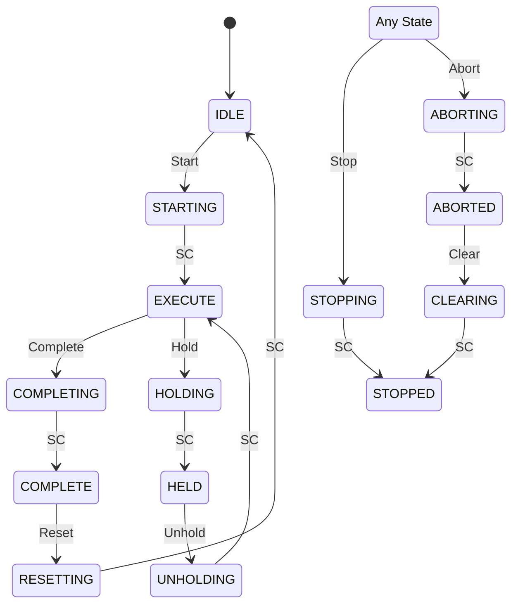

### [N.M] State Machine: {UNIT_NAME}

#### [N.M.1] State Diagram

> SC = State Complete (internal transition trigger indicating the state's actions are finished).

#### [N.M.2] {State Descriptions / Toestandsbeschrijvingen}

| State | {Description / Beschrijving} | {Actions / Acties} |
|-------|------|--------|
| IDLE | {DESC} | {ACTIONS} |
| STARTING | {DESC} | {ACTIONS} |
| EXECUTE | {DESC} | {ACTIONS} |
| COMPLETING | {DESC} | {ACTIONS} |
| COMPLETE | {DESC} | {ACTIONS} |
| RESETTING | {DESC} | {ACTIONS} |
| HOLDING | {DESC} | {ACTIONS} |
| HELD | {DESC} | {ACTIONS} |
| UNHOLDING | {DESC} | {ACTIONS} |
| STOPPING | {DESC} | {ACTIONS} |
| STOPPED | {DESC} | {ACTIONS} |
| ABORTING | {DESC} | {ACTIONS} |
| ABORTED | {DESC} | {ACTIONS} |
| CLEARING | {DESC} | {ACTIONS} |

#### [N.M.3] {Transitions / Overgangen}

| {From / Van} | {To / Naar} | {Trigger / Trigger} | {Condition / Conditie} | {Action / Actie} |
|------|------|---------|-----------|--------|
| IDLE | STARTING | Start cmd | {COND} | {ACTION} |
| STARTING | EXECUTE | SC | {COND} | {ACTION} |
| EXECUTE | COMPLETING | Complete cmd | {COND} | {ACTION} |
| COMPLETING | COMPLETE | SC | {COND} | {ACTION} |
| COMPLETE | RESETTING | Reset cmd | {COND} | {ACTION} |
| RESETTING | IDLE | SC | {COND} | {ACTION} |
| EXECUTE | HOLDING | Hold cmd | {COND} | {ACTION} |
| HOLDING | HELD | SC | {COND} | {ACTION} |
| HELD | UNHOLDING | Unhold cmd | {COND} | {ACTION} |
| UNHOLDING | EXECUTE | SC | {COND} | {ACTION} |
| {ANY} | STOPPING | Stop cmd | {COND} | {ACTION} |
| STOPPING | STOPPED | SC | {COND} | {ACTION} |
| {ANY} | ABORTING | Abort cmd | {COND} | {ACTION} |
| ABORTING | ABORTED | SC | {COND} | {ACTION} |
| ABORTED | CLEARING | Clear cmd | {COND} | {ACTION} |
| CLEARING | STOPPED | SC | {COND} | {ACTION} |
